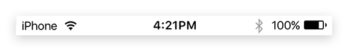

---
---
# Object "statusBar"

<a href="https://developer.mozilla.org/en-US/docs/Web/JavaScript/Reference/Global_Objects/Object" title="View &quot;Object&quot; on MDN">Object</a> > <a href="NativeObject.html" title="NativeObject Class Reference">NativeObject</a> > <a href="#" >StatusBar</a>

The status bar is the area where notifications, status icons and device time are displayed. The singleton instance can be accessed via `statusBar`.


<div class="tabris-image"><figure><div></div><figcaption>Android</figcaption></figure><figure><div></div><figcaption>iOS</figcaption></figure></div>

Type: | <code style="white-space: nowrap">StatusBar extends <a href="NativeObject.html" title="NativeObject Class Reference">NativeObject</a></code>
Constructor: | private
Singleton: | `statusBar`
Namespace: |<a href="../modules.html#startup" >tabris</a>
Direct subclasses: | None
JSX Support: | No


## Examples
### JavaScript


```js
import {statusBar} from 'tabris';

statusBar.background = 'red';
statusBar.displayMode = 'float';
```


See also:
  
[<span class='language js'>JS</span> Demonstrating various `StatusBar` properties](https://github.com/eclipsesource/tabris-js/tree/v3.8.0/snippets/statusbar.js) <span style="font-size: 75%;">[<a href="https://playground.tabris.com/?gitref=v3.8.0&snippet=statusbar.js" style="color: cadetblue;">► Run in Playground</a>]</span>

## Properties

### background


Background color of the status bar. Should be used in conjunction with the `theme` property to keep the status bar icons legible.

Type: |<code style="white-space: nowrap"><a href="Color.html#colorvalue" title="Color Class Type">ColorValue</a></code>
Settable: | <a href="../widget-basics.html#widget-properties" >Yes</a>
Change Event: | [`backgroundChanged`](#backgroundchanged)


### displayMode


Controls how the status bar is positioned relative to the `contentView`. The value `default` places the content below the status bar. The `hide` option lets the status bar disappear, making more room for the content. The `float` option lets the content flow underneath the status bar.

Type: |<code style="white-space: nowrap"><a href="https://developer.mozilla.org/en-US/docs/Web/JavaScript/Data_structures#string_type" title="View &quot;string&quot; on MDN">'default'</a> &#124; <a href="https://developer.mozilla.org/en-US/docs/Web/JavaScript/Data_structures#string_type" title="View &quot;string&quot; on MDN">'hide'</a> &#124; <a href="https://developer.mozilla.org/en-US/docs/Web/JavaScript/Data_structures#string_type" title="View &quot;string&quot; on MDN">'float'</a></code>
Default: | <code style="white-space: nowrap"><a href="https://developer.mozilla.org/en-US/docs/Web/JavaScript/Data_structures#string_type" title="View &quot;string&quot; on MDN">'default'</a></code>
Settable: | <a href="../widget-basics.html#widget-properties" >Yes</a>
Change Event: | [`displayModeChanged`](#displaymodechanged)


### height


The height of the status bar in device independent pixel. Can be used in conjunction with the `displayMode` `'float'` to offset the content as to not have it covered by the status bar.

Type: |<code style="white-space: nowrap"><a href="https://developer.mozilla.org/en-US/docs/Web/JavaScript/Data_structures#number_type" title="View &quot;number&quot; on MDN">number</a></code>
Settable: | <a href="../widget-basics.html#widget-properties" >No</a>
Change Event: | Not supported


### theme


Defines the shade used on the status bar. A `dark` theme sets the foreground icons to be of a light color, whereas `light` sets the icons to a dark color. The theme should be set in conjunction with the `background` property for contrast. The value `default` selects the default theme that depends on the device and on the app. Available on iOS and Android 6+.

Type: |<code style="white-space: nowrap"><a href="https://developer.mozilla.org/en-US/docs/Web/JavaScript/Data_structures#string_type" title="View &quot;string&quot; on MDN">'default'</a> &#124; <a href="https://developer.mozilla.org/en-US/docs/Web/JavaScript/Data_structures#string_type" title="View &quot;string&quot; on MDN">'light'</a> &#124; <a href="https://developer.mozilla.org/en-US/docs/Web/JavaScript/Data_structures#string_type" title="View &quot;string&quot; on MDN">'dark'</a></code>
Default: | <code style="white-space: nowrap"><a href="https://developer.mozilla.org/en-US/docs/Web/JavaScript/Data_structures#string_type" title="View &quot;string&quot; on MDN">'default'</a></code>
Settable: | <a href="../widget-basics.html#widget-properties" >Yes</a>
Change Event: | [`themeChanged`](#themechanged)


## Events

### tap

<p class="platforms"><span class='ios-tag' title='supported on iOS'>iOS</span></p>Fired when status bar is tapped.

EventObject Type: <code style="white-space: nowrap">StatusBarTapEvent&lt;<a href="#" >StatusBar</a>&gt;</code>

Property|Type|Description
-|-|-
touches | <code style="white-space: nowrap">{x: number, y: number}[]</code> | Touch coordinates relative to the origin coordinates of the widget.

## Change Events

### themeChanged

Fired when the [theme](#theme) property has changed.

EventObject Type: <code style="white-space: nowrap"><a href="ChangeListeners.html#propertychangedeventtargettype-valuetype" title="ChangeListeners Class Type">PropertyChangedEvent</a>&lt;<a href="#" >StatusBar</a>, <a href="https://developer.mozilla.org/en-US/docs/Web/JavaScript/Data_structures#string_type" title="View &quot;string&quot; on MDN">string</a>&gt;</code>

Property|Type|Description
-|-|-
value | <code style="white-space: nowrap"><a href="https://developer.mozilla.org/en-US/docs/Web/JavaScript/Data_structures#string_type" title="View &quot;string&quot; on MDN">string</a></code> | The new value of [theme](#theme).

### displayModeChanged

Fired when the [displayMode](#displaymode) property has changed.

EventObject Type: <code style="white-space: nowrap"><a href="ChangeListeners.html#propertychangedeventtargettype-valuetype" title="ChangeListeners Class Type">PropertyChangedEvent</a>&lt;<a href="#" >StatusBar</a>, <a href="https://developer.mozilla.org/en-US/docs/Web/JavaScript/Data_structures#string_type" title="View &quot;string&quot; on MDN">string</a>&gt;</code>

Property|Type|Description
-|-|-
value | <code style="white-space: nowrap"><a href="https://developer.mozilla.org/en-US/docs/Web/JavaScript/Data_structures#string_type" title="View &quot;string&quot; on MDN">string</a></code> | The new value of [displayMode](#displaymode).

### backgroundChanged

Fired when the [background](#background) property has changed.

EventObject Type: <code style="white-space: nowrap"><a href="ChangeListeners.html#propertychangedeventtargettype-valuetype" title="ChangeListeners Class Type">PropertyChangedEvent</a>&lt;<a href="#" >StatusBar</a>, <a href="Color.html#colorvalue" title="Color Class Type">ColorValue</a>&gt;</code>

Property|Type|Description
-|-|-
value | <code style="white-space: nowrap"><a href="Color.html#colorvalue" title="Color Class Type">ColorValue</a></code> | The new value of [background](#background).


