---
---
# Widget Overview

To build a comprehensive user experience, different UI components can be combined. The following list shows all available widgets for Android and iOS.

## [Action](Action.html)

An executable item that is integrated in the application's navigation menu. Add a *select* listener to react to action taps.

<a style="text-decoration: none" href="Action.html">
<figure>

<figcaption>Android</figcaption></figure><figure>
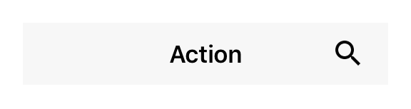
<figcaption>iOS</figcaption></figure>

</a>

## [ActivityIndicator](ActivityIndicator.html)

A widget representing a spinning indicator for indeterminate loading / processing time.

<a style="text-decoration: none" href="ActivityIndicator.html">
<figure>

<figcaption>Android</figcaption></figure><figure>

<figcaption>iOS</figcaption></figure>

</a>

## [Button](Button.html)

A push button. Can contain a text or an image.

<a style="text-decoration: none" href="Button.html">
<figure>
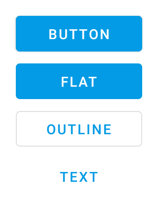
<figcaption>Android</figcaption></figure><figure>

<figcaption>iOS</figcaption></figure>

</a>

## [CameraView](CameraView.html)

A widget to preview a `Camera` feed.

In order to show a camera preview image the app has to hold the `'camera'` permission.

<a style="text-decoration: none" href="CameraView.html">
<figure>
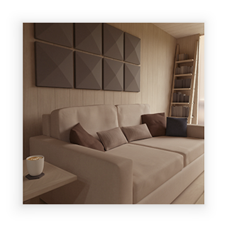
<figcaption>Android</figcaption></figure><figure>
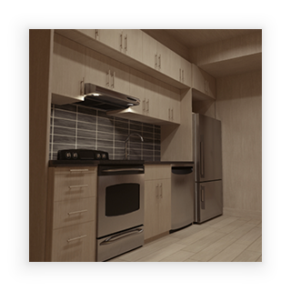
<figcaption>iOS</figcaption></figure>

</a>

## [Canvas](Canvas.html)

Canvas is a widget that can be used to draw graphics using a [canvas context](./CanvasContext.md).

<a style="text-decoration: none" href="Canvas.html">
<figure>

<figcaption>Android</figcaption></figure><figure>

<figcaption>iOS</figcaption></figure>

</a>

## [CheckBox](CheckBox.html)

A check box widget.

<a style="text-decoration: none" href="CheckBox.html">
<figure>
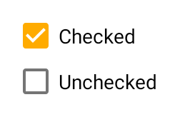
<figcaption>Android</figcaption></figure><figure>

<figcaption>iOS</figcaption></figure>

</a>

## [CollectionView](CollectionView.html)

A scrollable list that displays data items in cells, one per row. Cells are created on demand by the *createCell* callback and reused on scrolling.

<a style="text-decoration: none" href="CollectionView.html">
<figure>
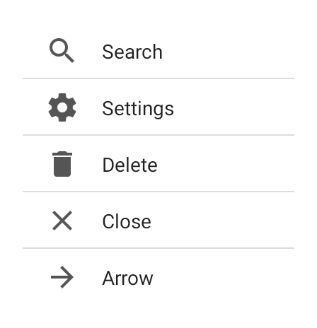
<figcaption>Android</figcaption></figure><figure>
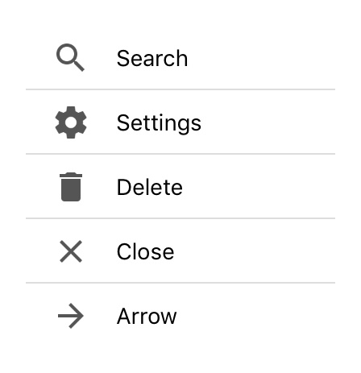
<figcaption>iOS</figcaption></figure>

</a>

## [Composite](Composite.html)

An empty widget that can contain other widgets.

<a style="text-decoration: none" href="Composite.html">
<figure>

<figcaption>Android</figcaption></figure><figure>
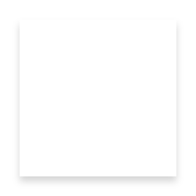
<figcaption>iOS</figcaption></figure>

</a>

## [Drawer](Drawer.html)

A drawer that can be swiped in from the left edge of the screen. There's only a single instance that can be accessed via `tabris.drawer`. The drawer is locked by default. To use it in an application, set the property `enabled` to `true`. The drawer can contain any kind of widgets.

<a style="text-decoration: none" href="Drawer.html">
<figure>

<figcaption>Android</figcaption></figure><figure>

<figcaption>iOS</figcaption></figure>

</a>

## [ImageView](ImageView.html)

A widget to display an image.

<a style="text-decoration: none" href="ImageView.html">
<figure>

<figcaption>Android</figcaption></figure><figure>

<figcaption>iOS</figcaption></figure>

</a>

## [NavigationView](NavigationView.html)

A widget that displays a stack of [pages](Page) with a toolbar that allows to navigate back. The toolbar also displays the current page's title and the highest priority [actions](Action) that are added to the NavigationView. Only children of type `Page`, `Action` and `SearchAction` are supported. Since the NavigationView does not compute its own size, the width and height must be defined by the respective layout properties (e.g. either `width` or `left` and `right` must be specified).

<a style="text-decoration: none" href="NavigationView.html">
<figure>
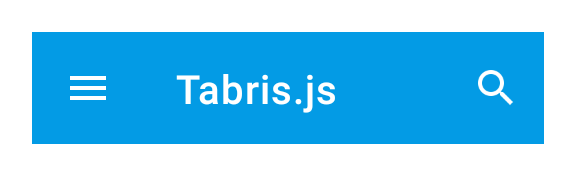
<figcaption>Android</figcaption></figure><figure>

<figcaption>iOS</figcaption></figure>

</a>

## [Page](Page.html)

A container representing a single page of a NavigationView widget.

<a style="text-decoration: none" href="Page.html">
<figure>

<figcaption>Android</figcaption></figure><figure>

<figcaption>iOS</figcaption></figure>

</a>

## [Picker](Picker.html)

A widget with a drop-down list of items to choose from.

<a style="text-decoration: none" href="Picker.html">
<figure>
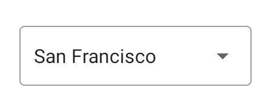
<figcaption>Android</figcaption></figure><figure>

<figcaption>iOS</figcaption></figure>

</a>

## [ProgressBar](ProgressBar.html)

A widget representing a numeric value as a horizontal bar with a growing indicator.

<a style="text-decoration: none" href="ProgressBar.html">
<figure>
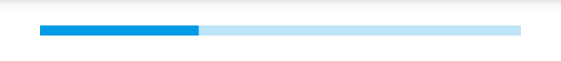
<figcaption>Android</figcaption></figure><figure>

<figcaption>iOS</figcaption></figure>

</a>

## [RadioButton](RadioButton.html)

A radio button. Selecting a radio button de-selects all its siblings (i.e. all radio buttons within the same parent).

<a style="text-decoration: none" href="RadioButton.html">
<figure>

<figcaption>Android</figcaption></figure><figure>
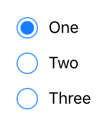
<figcaption>iOS</figcaption></figure>

</a>

## [RefreshComposite](RefreshComposite.html)

A composite allowing to use a pull-to-refresh gesture to trigger and visualize a long running operation.

<a style="text-decoration: none" href="RefreshComposite.html">
<figure>

<figcaption>Android</figcaption></figure><figure>

<figcaption>iOS</figcaption></figure>

</a>

## [ScrollView](ScrollView.html)

A composite that allows its content to overflow either vertically (default) or horizontally. Since the ScrollView does not compute its own size, the width and height must be defined by the respective layout properties (e.g. either `width` or `left` and `right` must be specified).

<a style="text-decoration: none" href="ScrollView.html">
<figure>
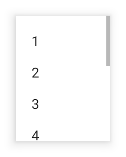
<figcaption>Android</figcaption></figure><figure>

<figcaption>iOS</figcaption></figure>

</a>

## [SearchAction](SearchAction.html)

An action that displays a search text field with dynamic proposals when selected. Add a listener on *select* to implement the action. On *input*, you may set a list of *proposals*.

<a style="text-decoration: none" href="SearchAction.html">
<figure>

<figcaption>Android</figcaption></figure><figure>

<figcaption>iOS</figcaption></figure>

</a>

## [Slider](Slider.html)

A widget representing a numeric value as an movable indicator on a horizontal line.

<a style="text-decoration: none" href="Slider.html">
<figure>

<figcaption>Android</figcaption></figure><figure>
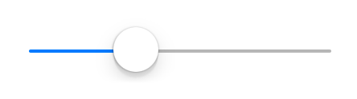
<figcaption>iOS</figcaption></figure>

</a>

## [Switch](Switch.html)

A switch widget that can be toggled.

<a style="text-decoration: none" href="Switch.html">
<figure>

<figcaption>Android</figcaption></figure><figure>

<figcaption>iOS</figcaption></figure>

</a>

## [Tab](Tab.html)

A container representing a single tab of a TabFolder widget.

<a style="text-decoration: none" href="Tab.html">
<figure>

<figcaption>Android</figcaption></figure><figure>

<figcaption>iOS</figcaption></figure>

</a>

## [TabFolder](TabFolder.html)

A widget that can switch between [tabs](Tab). Only children of type `Tab` are supported. Since the TabFolder does not compute its own size, the width and height must be defined by the respective layout properties (e.g. either `width` or `left` and `right` must be specified).

<a style="text-decoration: none" href="TabFolder.html">
<figure>
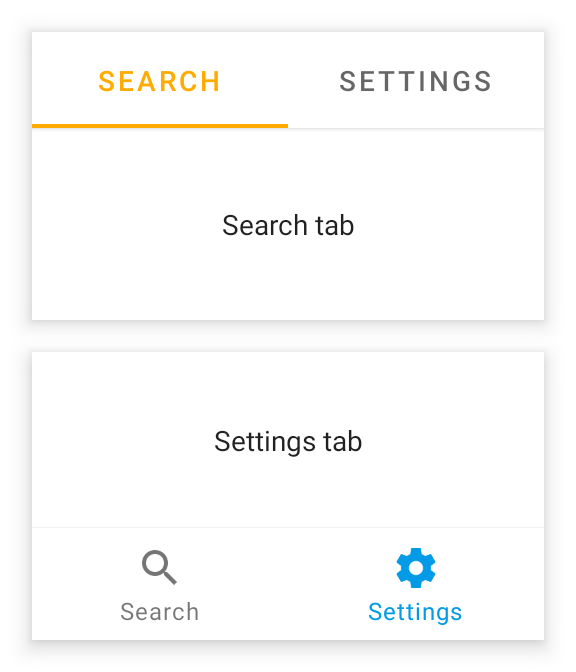
<figcaption>Android</figcaption></figure><figure>

<figcaption>iOS</figcaption></figure>

</a>

## [TextInput](TextInput.html)

A widget that allows to enter text.

<a style="text-decoration: none" href="TextInput.html">
<figure>

<figcaption>Android</figcaption></figure><figure>

<figcaption>iOS</figcaption></figure>

</a>

## [TextView](TextView.html)

A widget to display a text. For images, use ImageView.

<a style="text-decoration: none" href="TextView.html">
<figure>

<figcaption>Android</figcaption></figure><figure>

<figcaption>iOS</figcaption></figure>

</a>

## [ToggleButton](ToggleButton.html)

A push button that "snaps in", i.e. it is selected when pressed and deselected when pressed again.

<a style="text-decoration: none" href="ToggleButton.html">
<figure>

<figcaption>Android</figcaption></figure><figure>

<figcaption>iOS</figcaption></figure>

</a>

## [Video](Video.html)

A widget that plays a video from an URL.

<a style="text-decoration: none" href="Video.html">
<figure>
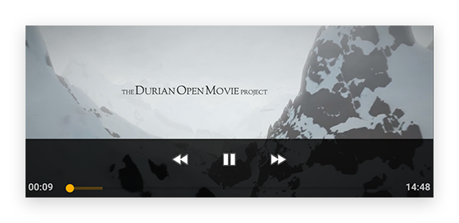
<figcaption>Android</figcaption></figure><figure>

<figcaption>iOS</figcaption></figure>

</a>

## [WebView](WebView.html)

A widget that can display a web page. Since this widget requires a lot of resources it's recommended to have no more than one instance at a time.

<a style="text-decoration: none" href="WebView.html">
<figure>
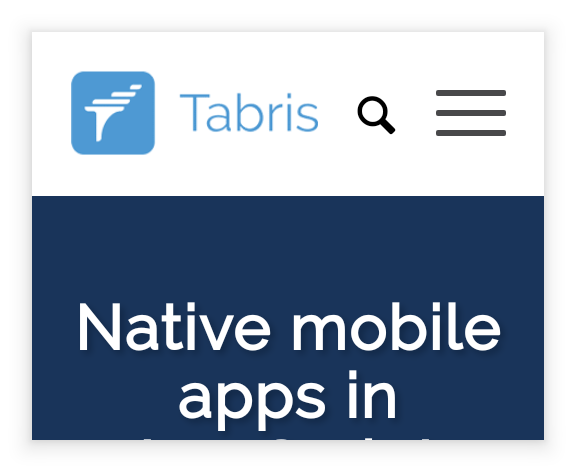
<figcaption>Android</figcaption></figure><figure>
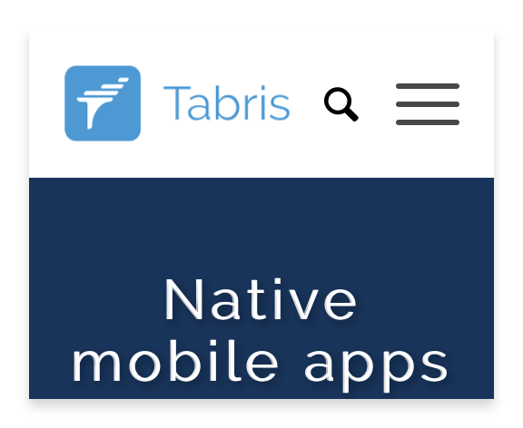
<figcaption>iOS</figcaption></figure>

</a>

