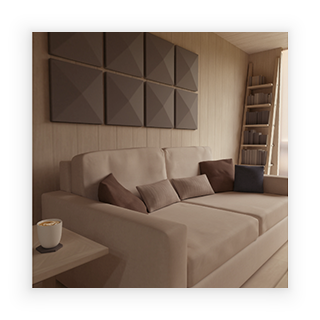

---
---
# Class "CameraView"

<a href="https://developer.mozilla.org/en-US/docs/Web/JavaScript/Reference/Global_Objects/Object" title="View &quot;Object&quot; on MDN">Object</a> > <a href="NativeObject.html" title="NativeObject Class Reference">NativeObject</a> > <a href="Widget.html" title="Widget Class Reference">Widget</a> > <a href="#" >CameraView</a>

A widget to preview a `Camera` feed.

In order to show a camera preview image the app has to hold the `'camera'` permission.


<div class="tabris-image"><figure><div></div><figcaption>Android</figcaption></figure><figure><div></div><figcaption>iOS</figcaption></figure></div>

Type: | <code style="white-space: nowrap">CameraView extends <a href="Widget.html" title="Widget Class Reference">Widget</a></code>
Constructor: | public
Singleton: | No
Namespace: |<a href="../modules.html#startup" >tabris</a>
Direct subclasses: | None
JSX Support: | Element: <code style="white-space: nowrap"><a href="#" >&lt;CameraView/&gt;</a></code><br/>Parent Elements: <code style="white-space: nowrap"><a href="Canvas.html" title="Canvas Class Reference">&lt;Canvas/&gt;</a></code>, <code style="white-space: nowrap"><a href="Cell.html" title="Cell Class Reference">&lt;Cell/&gt;</a></code>, <code style="white-space: nowrap"><a href="Composite.html" title="Composite Class Reference">&lt;Composite/&gt;</a></code>, <code style="white-space: nowrap"><a href="Page.html" title="Page Class Reference">&lt;Page/&gt;</a></code>, <code style="white-space: nowrap"><a href="RefreshComposite.html" title="RefreshComposite Class Reference">&lt;RefreshComposite/&gt;</a></code>, <code style="white-space: nowrap"><a href="Row.html" title="Row Class Reference">&lt;Row/&gt;</a></code>, <code style="white-space: nowrap"><a href="ScrollView.html" title="ScrollView Class Reference">&lt;ScrollView/&gt;</a></code>, <code style="white-space: nowrap"><a href="Stack.html" title="Stack Class Reference">&lt;Stack/&gt;</a></code>, <code style="white-space: nowrap"><a href="Tab.html" title="Tab Class Reference">&lt;Tab/&gt;</a></code><br/>Child Elements: *Not Supported*<br/>

## Examples
### JavaScript


```js
import {CameraView, contentView, device} from 'tabris';

const camera = device.cameras[0];
camera.active = true;

new CameraView({
  layoutData: 'stretch',
  camera
}).appendTo(contentView);
```


### JSX


```jsx
import {CameraView, contentView, device} from 'tabris';

const camera = device.cameras[0];
camera.active = true;

contentView.append(
  <CameraView stretch camera={camera}/>
);
```


See also:
  
[<span class='language tsx'>TSX</span> Simple example to capture an image](https://github.com/eclipsesource/tabris-js/tree/v3.9.0/snippets/camera.tsx) <span style="font-size: 75%;">[<a href="https://playground.tabris.com/?gitref=v3.9.0&snippet=camera.tsx" style="color: cadetblue;">► Run in Playground</a>]</span>  
[<span class='language tsx'>TSX</span> Control `Camera` and `CameraView` to capture an image](https://github.com/eclipsesource/tabris-js/tree/v3.9.0/snippets/camera-advanced.tsx) <span style="font-size: 75%;">[<a href="https://playground.tabris.com/?gitref=v3.9.0&snippet=camera-advanced.tsx" style="color: cadetblue;">► Run in Playground</a>]</span>

## Constructor

### new CameraView(properties?)

Parameter|Type|Description
-|-|-
properties | <code style="white-space: nowrap"><a href="Widget.html#propertieswidget" title="Widget Class Type">Properties</a>&lt;<a href="#" >CameraView</a>&gt;</code> | Sets all key-value pairs in the properties object as widget properties. *Optional.*

## Properties

### camera


The source video feed to display. In order to show a preview the `Camera` has to be in an active state. When the `Camera` is inactive or no `Camera` is assigned the `CameraView` shows a blank screen. 

It is recommended to deactivate the `Camera` when not in use in order to preserve battery life.

Type: |<code style="white-space: nowrap"><a href="Camera.html" title="Camera Class Reference">Camera</a></code>
Default: | <code style="white-space: nowrap"><a href="https://developer.mozilla.org/en-US/docs/Web/JavaScript/Reference/Global_Objects/Object" title="View &quot;Object&quot; on MDN">null</a></code>
Settable: | <a href="../widget-basics.html#widget-properties" >Yes</a>
Change Event: | [`cameraChanged`](#camerachanged)


### scaleMode


How to scale the camera preview image.

- `fit` will scale the image proportionally to fit into the view, possible leaving some empty space at the edges. That is, the image will be displayed as large as possible while being fully contained in the view.
- `fill` will scale the image proportionally to fill the entire view, possibly cutting off parts of the image. That is, the image will be displayed as small as possible while covering the entire view.

Type: |<code style="white-space: nowrap"><a href="https://developer.mozilla.org/en-US/docs/Web/JavaScript/Data_structures#string_type" title="View &quot;string&quot; on MDN">'fit'</a> &#124; <a href="https://developer.mozilla.org/en-US/docs/Web/JavaScript/Data_structures#string_type" title="View &quot;string&quot; on MDN">'fill'</a></code>
Default: | <code style="white-space: nowrap"><a href="https://developer.mozilla.org/en-US/docs/Web/JavaScript/Data_structures#string_type" title="View &quot;string&quot; on MDN">'fit'</a></code>
Settable: | <a href="../widget-basics.html#widget-properties" >Yes</a>
Change Event: | [`scaleModeChanged`](#scalemodechanged)


## Change Events

### cameraChanged

Fired when the [camera](#camera) property has changed.

EventObject Type: <code style="white-space: nowrap"><a href="ChangeListeners.html#propertychangedeventtargettype-valuetype" title="ChangeListeners Class Type">PropertyChangedEvent</a>&lt;<a href="#" >CameraView</a>, <a href="Camera.html" title="Camera Class Reference">Camera</a>&gt;</code>

Property|Type|Description
-|-|-
value | <code style="white-space: nowrap"><a href="Camera.html" title="Camera Class Reference">Camera</a></code> | The new value of [camera](#camera).

### scaleModeChanged

Fired when the [scaleMode](#scalemode) property has changed.

EventObject Type: <code style="white-space: nowrap"><a href="ChangeListeners.html#propertychangedeventtargettype-valuetype" title="ChangeListeners Class Type">PropertyChangedEvent</a>&lt;<a href="#" >CameraView</a>, <a href="https://developer.mozilla.org/en-US/docs/Web/JavaScript/Data_structures#string_type" title="View &quot;string&quot; on MDN">'fit'</a> &#124; <a href="https://developer.mozilla.org/en-US/docs/Web/JavaScript/Data_structures#string_type" title="View &quot;string&quot; on MDN">'fill'</a>&gt;</code>

Property|Type|Description
-|-|-
value | <code style="white-space: nowrap"><a href="https://developer.mozilla.org/en-US/docs/Web/JavaScript/Data_structures#string_type" title="View &quot;string&quot; on MDN">'fit'</a> &#124; <a href="https://developer.mozilla.org/en-US/docs/Web/JavaScript/Data_structures#string_type" title="View &quot;string&quot; on MDN">'fill'</a></code> | The new value of [scaleMode](#scalemode).


