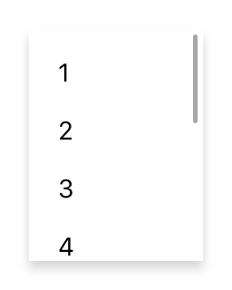

---
---
# Class "ScrollView"

<a href="https://developer.mozilla.org/en-US/docs/Web/JavaScript/Reference/Global_Objects/Object" title="View &quot;Object&quot; on MDN">Object</a> > <a href="NativeObject.html" title="NativeObject Class Reference">NativeObject</a> > <a href="Widget.html" title="Widget Class Reference">Widget</a> > <a href="Composite.html" title="Composite Class Reference">Composite</a> > <a href="#" >ScrollView</a>

A composite that allows its content to overflow either vertically (default) or horizontally. Since the ScrollView does not compute its own size, the width and height must be defined by the respective layout properties (e.g. either `width` or `left` and `right` must be specified).


<div class="tabris-image"><figure><div></div><figcaption>Android</figcaption></figure><figure><div></div><figcaption>iOS</figcaption></figure></div>

Type: | <code style="white-space: nowrap">ScrollView extends <a href="Composite.html" title="Composite Class Reference">Composite</a></code>
Constructor: | public
Singleton: | No
Namespace: |<a href="../modules.html#startup" >tabris</a>
Direct subclasses: | None
JSX Support: | Element: <code style="white-space: nowrap"><a href="#" >&lt;ScrollView/&gt;</a></code><br/>Parent Elements: <code style="white-space: nowrap"><a href="Canvas.html" title="Canvas Class Reference">&lt;Canvas/&gt;</a></code>, <code style="white-space: nowrap"><a href="Cell.html" title="Cell Class Reference">&lt;Cell/&gt;</a></code>, <code style="white-space: nowrap"><a href="Composite.html" title="Composite Class Reference">&lt;Composite/&gt;</a></code>, <code style="white-space: nowrap"><a href="Page.html" title="Page Class Reference">&lt;Page/&gt;</a></code>, <code style="white-space: nowrap"><a href="RefreshComposite.html" title="RefreshComposite Class Reference">&lt;RefreshComposite/&gt;</a></code>, <code style="white-space: nowrap"><a href="Row.html" title="Row Class Reference">&lt;Row/&gt;</a></code>, <code style="white-space: nowrap"><a href="#" >&lt;ScrollView/&gt;</a></code>, <code style="white-space: nowrap"><a href="Stack.html" title="Stack Class Reference">&lt;Stack/&gt;</a></code>, <code style="white-space: nowrap"><a href="Tab.html" title="Tab Class Reference">&lt;Tab/&gt;</a></code><br/>Child Elements: *Any standalone widget element*<br/>

## Examples
### JavaScript


```js
import {ScrollView, TextView, contentView} from 'tabris';

const scrollView = new ScrollView({layoutData: 'stretch'})
  .appendTo(contentView);

new TextView({text: 'Scrollable content'})
  .appendTo(scrollView);
```


See also:
  
[<span class='language jsx'>JSX</span> Creating a simple `ScrollView`](https://github.com/eclipsesource/tabris-js/tree/v3.9.0/snippets/scrollview.jsx) <span style="font-size: 75%;">[<a href="https://playground.tabris.com/?gitref=v3.9.0&snippet=scrollview.jsx" style="color: cadetblue;">► Run in Playground</a>]</span>  
[<span class='language jsx'>JSX</span> How to implement parallax scrolling with a `ScrollView`](https://github.com/eclipsesource/tabris-js/tree/v3.9.0/snippets/scrollview-parallax.jsx) <span style="font-size: 75%;">[<a href="https://playground.tabris.com/?gitref=v3.9.0&snippet=scrollview-parallax.jsx" style="color: cadetblue;">► Run in Playground</a>]</span>

## Constructor

### new ScrollView(properties?)

Parameter|Type|Description
-|-|-
properties | <code style="white-space: nowrap"><a href="Widget.html#propertieswidget" title="Widget Class Type">Properties</a>&lt;<a href="#" >ScrollView</a>&gt;</code> | Sets all key-value pairs in the properties object as widget properties. *Optional.*

## Methods

### scrollToX(offset, options?)


Scrolls to the given horizontal offset. Give `{animate: false}` as the second parameter to suppress the animation.


Parameter|Type|Description
-|-|-
offset | <code style="white-space: nowrap"><a href="https://developer.mozilla.org/en-US/docs/Web/JavaScript/Data_structures#number_type" title="View &quot;number&quot; on MDN">number</a></code> | The offset to scroll to in dip.
options | <code style="white-space: nowrap">{<br/>&nbsp;&nbsp;animate: <a href="https://developer.mozilla.org/en-US/docs/Web/JavaScript/Data_structures#boolean_type" title="View &quot;boolean&quot; on MDN">boolean</a> // defaults to true<br/>}</code> | An additional parameter object to control the animation. *Optional.*


Returns: <code style="white-space: nowrap"><a href="#" title="This object">this</a></code>

### scrollToY(offset, options?)


Scrolls to the given vertical offset. Give `{animate: false}` as the second parameter to suppress the animation.


Parameter|Type|Description
-|-|-
offset | <code style="white-space: nowrap"><a href="https://developer.mozilla.org/en-US/docs/Web/JavaScript/Data_structures#number_type" title="View &quot;number&quot; on MDN">number</a></code> | The offset to scroll to in dip.
options | <code style="white-space: nowrap">{<br/>&nbsp;&nbsp;animate: <a href="https://developer.mozilla.org/en-US/docs/Web/JavaScript/Data_structures#boolean_type" title="View &quot;boolean&quot; on MDN">boolean</a> // defaults to true<br/>}</code> | An parameter object to control the animation. *Optional.*


Returns: <code style="white-space: nowrap"><a href="#" title="This object">this</a></code>


## Properties

### direction


Specifies the scrolling direction of the scroll composite.

Type: |<code style="white-space: nowrap"><a href="https://developer.mozilla.org/en-US/docs/Web/JavaScript/Data_structures#string_type" title="View &quot;string&quot; on MDN">'vertical'</a> &#124; <a href="https://developer.mozilla.org/en-US/docs/Web/JavaScript/Data_structures#string_type" title="View &quot;string&quot; on MDN">'horizontal'</a></code>
Default: | <code style="white-space: nowrap"><a href="https://developer.mozilla.org/en-US/docs/Web/JavaScript/Data_structures#string_type" title="View &quot;string&quot; on MDN">'vertical'</a></code>
Settable: | <a href="../widget-basics.html#widget-properties" >By Constructor or JSX</a>
Change Event: | Not supported


This property can only be set via constructor or JSX. Once set, it cannot change anymore.


### offsetX


The horizontal scrolling position in dip.

Type: |<code style="white-space: nowrap"><a href="https://developer.mozilla.org/en-US/docs/Web/JavaScript/Data_structures#number_type" title="View &quot;number&quot; on MDN">number</a></code>
Settable: | <a href="../widget-basics.html#widget-properties" >No</a>
Change Event: | [`offsetXChanged`](#offsetxchanged)


### offsetY


The vertical scrolling position in dip.

Type: |<code style="white-space: nowrap"><a href="https://developer.mozilla.org/en-US/docs/Web/JavaScript/Data_structures#number_type" title="View &quot;number&quot; on MDN">number</a></code>
Settable: | <a href="../widget-basics.html#widget-properties" >No</a>
Change Event: | [`offsetYChanged`](#offsetychanged)


### scrollXState


The scroll state of the `ScrollView` in horizontal direction. The following states are supported:

* `rest` - no scrolling
* `drag` the user moves the `ScrollView` content with his finger
* `scroll` the user has flinged the content with his finger or the `ScrollView` is scrolling programmatically

Type: |<code style="white-space: nowrap"><a href="https://developer.mozilla.org/en-US/docs/Web/JavaScript/Data_structures#string_type" title="View &quot;string&quot; on MDN">'rest'</a> &#124; <a href="https://developer.mozilla.org/en-US/docs/Web/JavaScript/Data_structures#string_type" title="View &quot;string&quot; on MDN">'drag'</a> &#124; <a href="https://developer.mozilla.org/en-US/docs/Web/JavaScript/Data_structures#string_type" title="View &quot;string&quot; on MDN">'scroll'</a></code>
Default: | <code style="white-space: nowrap"><a href="https://developer.mozilla.org/en-US/docs/Web/JavaScript/Data_structures#string_type" title="View &quot;string&quot; on MDN">'rest'</a></code>
Settable: | <a href="../widget-basics.html#widget-properties" >No</a>
Change Event: | [`scrollXStateChanged`](#scrollxstatechanged)


### scrollYState


The scroll state of the `ScrollView` in vertical direction. The following states are supported:

* `rest` - no scrolling
* `drag` the user moves the `ScrollView` content with his finger
* `scroll` the user has flinged the `ScrollView` content with his finger or the `ScrollView` is scrolling programmatically

Type: |<code style="white-space: nowrap"><a href="https://developer.mozilla.org/en-US/docs/Web/JavaScript/Data_structures#string_type" title="View &quot;string&quot; on MDN">'rest'</a> &#124; <a href="https://developer.mozilla.org/en-US/docs/Web/JavaScript/Data_structures#string_type" title="View &quot;string&quot; on MDN">'drag'</a> &#124; <a href="https://developer.mozilla.org/en-US/docs/Web/JavaScript/Data_structures#string_type" title="View &quot;string&quot; on MDN">'scroll'</a></code>
Default: | <code style="white-space: nowrap"><a href="https://developer.mozilla.org/en-US/docs/Web/JavaScript/Data_structures#string_type" title="View &quot;string&quot; on MDN">'rest'</a></code>
Settable: | <a href="../widget-basics.html#widget-properties" >No</a>
Change Event: | [`scrollYStateChanged`](#scrollystatechanged)


### scrollbarVisible


Allows to show or hide scroll bar for current direction.

Type: |<code style="white-space: nowrap"><a href="https://developer.mozilla.org/en-US/docs/Web/JavaScript/Data_structures#boolean_type" title="View &quot;boolean&quot; on MDN">boolean</a></code>
Default: | <code style="white-space: nowrap"><a href="https://developer.mozilla.org/en-US/docs/Web/JavaScript/Data_structures#string_type" title="View &quot;string&quot; on MDN">true</a></code>
Settable: | <a href="../widget-basics.html#widget-properties" >Yes</a>
Change Event: | [`scrollbarVisibleChanged`](#scrollbarvisiblechanged)


## Events

### scrollX

Fired while scrolling horizontally.

EventObject Type: <code style="white-space: nowrap">ScrollViewScrollEvent&lt;<a href="#" >ScrollView</a>&gt;</code>

Property|Type|Description
-|-|-
offset | <code style="white-space: nowrap"><a href="https://developer.mozilla.org/en-US/docs/Web/JavaScript/Data_structures#number_type" title="View &quot;number&quot; on MDN">number</a></code> | Indicates the current horizontal scrolling position.

### scrollY

Fired while scrolling vertically.

EventObject Type: <code style="white-space: nowrap">ScrollViewScrollEvent&lt;<a href="#" >ScrollView</a>&gt;</code>

Property|Type|Description
-|-|-
offset | <code style="white-space: nowrap"><a href="https://developer.mozilla.org/en-US/docs/Web/JavaScript/Data_structures#number_type" title="View &quot;number&quot; on MDN">number</a></code> | Indicates the current vertical scrolling position.

## Change Events

### offsetXChanged

Fired when the [offsetX](#offsetx) property has changed.

EventObject Type: <code style="white-space: nowrap"><a href="ChangeListeners.html#propertychangedeventtargettype-valuetype" title="ChangeListeners Class Type">PropertyChangedEvent</a>&lt;<a href="#" >ScrollView</a>, <a href="https://developer.mozilla.org/en-US/docs/Web/JavaScript/Data_structures#number_type" title="View &quot;number&quot; on MDN">number</a>&gt;</code>

Property|Type|Description
-|-|-
value | <code style="white-space: nowrap"><a href="https://developer.mozilla.org/en-US/docs/Web/JavaScript/Data_structures#number_type" title="View &quot;number&quot; on MDN">number</a></code> | The new value of [offsetX](#offsetx).

### offsetYChanged

Fired when the [offsetY](#offsety) property has changed.

EventObject Type: <code style="white-space: nowrap"><a href="ChangeListeners.html#propertychangedeventtargettype-valuetype" title="ChangeListeners Class Type">PropertyChangedEvent</a>&lt;<a href="#" >ScrollView</a>, <a href="https://developer.mozilla.org/en-US/docs/Web/JavaScript/Data_structures#number_type" title="View &quot;number&quot; on MDN">number</a>&gt;</code>

Property|Type|Description
-|-|-
value | <code style="white-space: nowrap"><a href="https://developer.mozilla.org/en-US/docs/Web/JavaScript/Data_structures#number_type" title="View &quot;number&quot; on MDN">number</a></code> | The new value of [offsetY](#offsety).

### scrollbarVisibleChanged

Fired when the [scrollbarVisible](#scrollbarvisible) property has changed.

EventObject Type: <code style="white-space: nowrap"><a href="ChangeListeners.html#propertychangedeventtargettype-valuetype" title="ChangeListeners Class Type">PropertyChangedEvent</a>&lt;<a href="#" >ScrollView</a>, <a href="https://developer.mozilla.org/en-US/docs/Web/JavaScript/Data_structures#boolean_type" title="View &quot;boolean&quot; on MDN">boolean</a>&gt;</code>

Property|Type|Description
-|-|-
value | <code style="white-space: nowrap"><a href="https://developer.mozilla.org/en-US/docs/Web/JavaScript/Data_structures#boolean_type" title="View &quot;boolean&quot; on MDN">boolean</a></code> | The new value of [scrollbarVisible](#scrollbarvisible).

### scrollXStateChanged

Fired when the [scrollXState](#scrollxstate) property has changed.

EventObject Type: <code style="white-space: nowrap"><a href="ChangeListeners.html#propertychangedeventtargettype-valuetype" title="ChangeListeners Class Type">PropertyChangedEvent</a>&lt;<a href="#" >ScrollView</a>, <a href="https://developer.mozilla.org/en-US/docs/Web/JavaScript/Data_structures#string_type" title="View &quot;string&quot; on MDN">string</a>&gt;</code>

Property|Type|Description
-|-|-
value | <code style="white-space: nowrap"><a href="https://developer.mozilla.org/en-US/docs/Web/JavaScript/Data_structures#string_type" title="View &quot;string&quot; on MDN">string</a></code> | The new value of [scrollXState](#scrollxstate).

### scrollYStateChanged

Fired when the [scrollYState](#scrollystate) property has changed.

EventObject Type: <code style="white-space: nowrap"><a href="ChangeListeners.html#propertychangedeventtargettype-valuetype" title="ChangeListeners Class Type">PropertyChangedEvent</a>&lt;<a href="#" >ScrollView</a>, <a href="https://developer.mozilla.org/en-US/docs/Web/JavaScript/Data_structures#string_type" title="View &quot;string&quot; on MDN">string</a>&gt;</code>

Property|Type|Description
-|-|-
value | <code style="white-space: nowrap"><a href="https://developer.mozilla.org/en-US/docs/Web/JavaScript/Data_structures#string_type" title="View &quot;string&quot; on MDN">string</a></code> | The new value of [scrollYState](#scrollystate).


