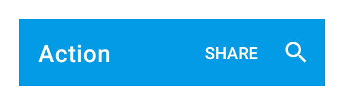
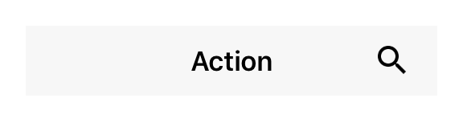

---
---
# Class "Action"

<a href="https://developer.mozilla.org/en-US/docs/Web/JavaScript/Reference/Global_Objects/Object" title="View &quot;Object&quot; on MDN">Object</a> > <a href="NativeObject.html" title="NativeObject Class Reference">NativeObject</a> > <a href="Widget.html" title="Widget Class Reference">Widget</a> > <a href="#" >Action</a>

An executable item that is integrated in the application's navigation menu. Add a *select* listener to react to action taps.


<div class="tabris-image"><figure><div></div><figcaption>Android</figcaption></figure><figure><div></div><figcaption>iOS</figcaption></figure></div>

Type: | <code style="white-space: nowrap">Action extends <a href="Widget.html" title="Widget Class Reference">Widget</a></code>
Constructor: | public
Singleton: | No
Namespace: |<a href="../modules.html#startup" >tabris</a>
Direct subclasses: | <code style="white-space: nowrap"><a href="SearchAction.html" title="SearchAction Class Reference">SearchAction</a></code>
JSX Support: | Element: <code style="white-space: nowrap"><a href="#" >&lt;Action/&gt;</a></code><br/>Parent Elements: <code style="white-space: nowrap"><a href="NavigationView.html" title="NavigationView Class Reference">&lt;NavigationView/&gt;</a></code><br/>Child Elements: *Not Supported*<br/>Element content sets: [<code style="white-space: nowrap">title</code>](#title)

## Examples
### JavaScript


```js
import {Action, NavigationView, contentView} from 'tabris';

const navigationView = new NavigationView({layoutData: 'stretch'})
  .appendTo(contentView);

new Action({
  title: 'Settings',
  image: 'resources/settings.png'
}).onSelect(() => console.log('Settings selected'))
  .appendTo(navigationView);
```


See also:
  
[<span class='language jsx'>JSX</span> Creating a simple `Action`](https://playground.tabris.com/?gitref=v3.6.1&snippet=navigationview-action.jsx)  
[<span class='language jsx'>JSX</span> Using placement property](https://playground.tabris.com/?gitref=v3.6.1&snippet=navigationview-action-placement.jsx)

## Constructor

### new Action(properties?)

Parameter|Type|Description
-|-|-
properties | <code style="white-space: nowrap"><a href="../types.html#propertieswidget" title="Properties&lt;Widget&gt;">Properties</a>&lt;<a href="#" >Action</a>&gt;</code> | Sets all key-value pairs in the properties object as widget properties. *Optional.*

## Properties

### image


Icon image for the action.

On iOS the `image` is tinted with the apps default accent color whereas on Android the `image` is shown as is. When an action is placed into a `NavigationView`, the `NavigationView` property `actionColor` can be used to adjust the action tint color.

Type: |<code style="white-space: nowrap"><a href="../types.html#imagevalue" title="ImageValue Type Reference">ImageValue</a></code>
Settable: | <a href="../widget-basics.html#widget-properties" >Yes</a>
Change Event: | [`imageChanged`](#imagechanged)


### placement


Actions with 'default' placement will be visible in the toolbar if enough space is available, otherwise moved to the overflow section. Setting the property to 'overflow' makes the action appear there exclusively. Lastly, 'navigation' puts the action in the position normally occupied by the drawer/back button. When 'navigation' is used, only the `Action` image will be shown. If multiple actions have this value only the first one is displayed.

Type: |<code style="white-space: nowrap"><a href="https://developer.mozilla.org/en-US/docs/Web/JavaScript/Data_structures#String_type" title="View &quot;string&quot; on MDN">'default'</a> &#124; <a href="https://developer.mozilla.org/en-US/docs/Web/JavaScript/Data_structures#String_type" title="View &quot;string&quot; on MDN">'overflow'</a> &#124; <a href="https://developer.mozilla.org/en-US/docs/Web/JavaScript/Data_structures#String_type" title="View &quot;string&quot; on MDN">'navigation'</a></code>
Default: | <code style="white-space: nowrap"><a href="https://developer.mozilla.org/en-US/docs/Web/JavaScript/Data_structures#String_type" title="View &quot;string&quot; on MDN">'default'</a></code>
Settable: | <a href="../widget-basics.html#widget-properties" >Yes</a>
Change Event: | [`placementChanged`](#placementchanged)


### title


The text to be displayed for the action.

When an action is placed into a `NavigationView`, the `NavigationView` property `actionTextColor` can be used to adjust the action title color on Android.

Type: |<code style="white-space: nowrap"><a href="https://developer.mozilla.org/en-US/docs/Web/JavaScript/Data_structures#String_type" title="View &quot;string&quot; on MDN">string</a></code>
Settable: | <a href="../widget-basics.html#widget-properties" >Yes</a>
Change Event: | [`titleChanged`](#titlechanged)
JSX Content Type: | [Text](../declarative-ui.md#jsx-specifics)


When using Action as an JSX element the elements Text content is mapped to this property.


## Events

### select

Fired when the action is invoked.

EventObject Type: <code style="white-space: nowrap"><a href="EventObject.html" title="EventObject Class Reference">EventObject</a>&lt;<a href="#" >Action</a>&gt;</code>

This event has no additional parameter.
## Change Events

### imageChanged

Fired when the [image](#image) property has changed.

EventObject Type: <code style="white-space: nowrap"><a href="../types.html#propertychangedeventtargettype-valuetype" title="PropertyChangedEvent&lt;TargetType, ValueType&gt;">PropertyChangedEvent</a>&lt;<a href="#" >Action</a>, <a href="../types.html#imagevalue" title="ImageValue Type Reference">ImageValue</a>&gt;</code>

Property|Type|Description
-|-|-
value | <code style="white-space: nowrap"><a href="../types.html#imagevalue" title="ImageValue Type Reference">ImageValue</a></code> | The new value of [image](#image).

### placementChanged

Fired when the [placement](#placement) property has changed.

EventObject Type: <code style="white-space: nowrap"><a href="../types.html#propertychangedeventtargettype-valuetype" title="PropertyChangedEvent&lt;TargetType, ValueType&gt;">PropertyChangedEvent</a>&lt;<a href="#" >Action</a>, <a href="https://developer.mozilla.org/en-US/docs/Web/JavaScript/Data_structures#String_type" title="View &quot;string&quot; on MDN">string</a>&gt;</code>

Property|Type|Description
-|-|-
value | <code style="white-space: nowrap"><a href="https://developer.mozilla.org/en-US/docs/Web/JavaScript/Data_structures#String_type" title="View &quot;string&quot; on MDN">string</a></code> | The new value of [placement](#placement).

### titleChanged

Fired when the [title](#title) property has changed.

EventObject Type: <code style="white-space: nowrap"><a href="../types.html#propertychangedeventtargettype-valuetype" title="PropertyChangedEvent&lt;TargetType, ValueType&gt;">PropertyChangedEvent</a>&lt;<a href="#" >Action</a>, <a href="https://developer.mozilla.org/en-US/docs/Web/JavaScript/Data_structures#String_type" title="View &quot;string&quot; on MDN">string</a>&gt;</code>

Property|Type|Description
-|-|-
value | <code style="white-space: nowrap"><a href="https://developer.mozilla.org/en-US/docs/Web/JavaScript/Data_structures#String_type" title="View &quot;string&quot; on MDN">string</a></code> | The new value of [title](#title).

