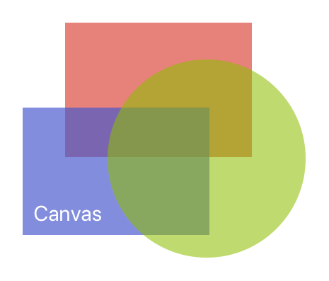

---
---
# Class "Canvas"

<a href="https://developer.mozilla.org/en-US/docs/Web/JavaScript/Reference/Global_Objects/Object" title="View &quot;Object&quot; on MDN">Object</a> > <a href="NativeObject.html" title="NativeObject Class Reference">NativeObject</a> > <a href="Widget.html" title="Widget Class Reference">Widget</a> > <a href="Composite.html" title="Composite Class Reference">Composite</a> > <a href="#" >Canvas</a>

Canvas is a widget that can be used to draw graphics using a [canvas context](./CanvasContext.md).


<div class="tabris-image"><figure><div></div><figcaption>Android</figcaption></figure><figure><div></div><figcaption>iOS</figcaption></figure></div>

Type: | <code style="white-space: nowrap">Canvas extends <a href="Composite.html" title="Composite Class Reference">Composite</a></code>
Constructor: | public
Singleton: | No
Namespace: |<a href="../modules.html#startup" >tabris</a>
Direct subclasses: | None
JSX Support: | Element: <code style="white-space: nowrap"><a href="#" >&lt;Canvas/&gt;</a></code><br/>Parent Elements: <code style="white-space: nowrap"><a href="#" >&lt;Canvas/&gt;</a></code>, <code style="white-space: nowrap"><a href="Cell.html" title="Cell Class Reference">&lt;Cell/&gt;</a></code>, <code style="white-space: nowrap"><a href="Composite.html" title="Composite Class Reference">&lt;Composite/&gt;</a></code>, <code style="white-space: nowrap"><a href="Page.html" title="Page Class Reference">&lt;Page/&gt;</a></code>, <code style="white-space: nowrap"><a href="RefreshComposite.html" title="RefreshComposite Class Reference">&lt;RefreshComposite/&gt;</a></code>, <code style="white-space: nowrap"><a href="Row.html" title="Row Class Reference">&lt;Row/&gt;</a></code>, <code style="white-space: nowrap"><a href="ScrollView.html" title="ScrollView Class Reference">&lt;ScrollView/&gt;</a></code>, <code style="white-space: nowrap"><a href="Stack.html" title="Stack Class Reference">&lt;Stack/&gt;</a></code>, <code style="white-space: nowrap"><a href="Tab.html" title="Tab Class Reference">&lt;Tab/&gt;</a></code><br/>Child Elements: *Any standalone widget element*<br/>

## Examples
### JavaScript


```js
import {Canvas, contentView} from 'tabris';

new Canvas({layoutData: 'stretch'})
  .onResize(({target: canvas, width, height}) => {
    const context = canvas.getContext('2d', width, height);
    context.moveTo(0, 0);
    // ...
  }).appendTo(contentView);
```


See also:
  
[<span class='language jsx'>JSX</span> Creating a `Canvas` with simple shapes](https://playground.tabris.com/?gitref=v3.6.1&snippet=canvas-shapes.jsx)  
[<span class='language jsx'>JSX</span> Creating a `Canvas` and working with `ImageData`](https://playground.tabris.com/?gitref=v3.6.1&snippet=canvas-imagedata.jsx)  
[<span class='language jsx'>JSX</span> How to show text on a `Canvas`](https://playground.tabris.com/?gitref=v3.6.1&snippet=canvas-text.jsx)  
[<span class='language jsx'>JSX</span> How to use animations on a `Canvas`](https://playground.tabris.com/?gitref=v3.6.1&snippet=canvas-animation.jsx)  
[<span class='language jsx'>JSX</span> canvas-arc.jsx](https://playground.tabris.com/?gitref=v3.6.1&snippet=canvas-arc.jsx)  
[<span class='language jsx'>JSX</span> canvas-imagebitmap.jsx](https://playground.tabris.com/?gitref=v3.6.1&snippet=canvas-imagebitmap.jsx)  
[<span class='language jsx'>JSX</span> canvas-to-image.jsx](https://playground.tabris.com/?gitref=v3.6.1&snippet=canvas-to-image.jsx)

## Constructor

### new Canvas(properties?)

Parameter|Type|Description
-|-|-
properties | <code style="white-space: nowrap"><a href="../types.html#propertieswidget" title="Properties&lt;Widget&gt;">Properties</a>&lt;<a href="#" >Canvas</a>&gt;</code> | Sets all key-value pairs in the properties object as widget properties. *Optional.*

## Methods

### getContext(contextType, width, height)


Returns the drawing context with the given size.


Parameter|Type|Description
-|-|-
contextType | <code style="white-space: nowrap"><a href="https://developer.mozilla.org/en-US/docs/Web/JavaScript/Data_structures#String_type" title="View &quot;string&quot; on MDN">string</a></code> | The context identifier. Only `"2d"` is supported.
width | <code style="white-space: nowrap"><a href="https://developer.mozilla.org/en-US/docs/Web/JavaScript/Data_structures#Number_type" title="View &quot;number&quot; on MDN">number</a></code> | the width of the canvas context to create
height | <code style="white-space: nowrap"><a href="https://developer.mozilla.org/en-US/docs/Web/JavaScript/Data_structures#Number_type" title="View &quot;number&quot; on MDN">number</a></code> | the height of the canvas context to create


Returns: <code style="white-space: nowrap"><a href="CanvasContext.html" title="CanvasContext Class Reference">CanvasContext</a></code>

### toBlob(callback, mimeType?, quality?)


Creates a Blob object representing the image contained in the canvas. This is a non-blocking operation.


Parameter|Type|Description
-|-|-
callback | <code style="white-space: nowrap">(<a href="Blob.html" title="Blob Class Reference">blob</a>) => <a href="https://developer.mozilla.org/en-US/docs/Web/JavaScript/Data_structures#Undefined_type" title="View &quot;undefined&quot; on MDN">void</a></code> | Callback that will be called with the resulting blob.
mimeType | <code style="white-space: nowrap"><a href="https://developer.mozilla.org/en-US/docs/Web/JavaScript/Data_structures#String_type" title="View &quot;string&quot; on MDN">'image/png'</a><br/>&#124; <a href="https://developer.mozilla.org/en-US/docs/Web/JavaScript/Data_structures#String_type" title="View &quot;string&quot; on MDN">'image/jpeg'</a><br/>&#124; <a href="https://developer.mozilla.org/en-US/docs/Web/JavaScript/Data_structures#String_type" title="View &quot;string&quot; on MDN">'image/webp'</a></code> | The expected image format. If `mimeType` is not specified or invalid, the image type is `image/png`. **On iOS the type `image/webp` is not supported. A png will be returned instead.** *Optional.*
quality | <code style="white-space: nowrap"><a href="https://developer.mozilla.org/en-US/docs/Web/JavaScript/Data_structures#Number_type" title="View &quot;number&quot; on MDN">number</a></code> | A Number between 0 and 1 specifying the image quality. A lower number results in a smaller file size at the same resolution. If `quality` is not specified or invalid the value `0.92` is for `image/jpeg` and  `0.80` for `image/webp` respectively. The value has no effect for `image/png`. *Optional.*


Returns: <code style="white-space: nowrap"><a href="https://developer.mozilla.org/en-US/docs/Web/JavaScript/Data_structures#Undefined_type" title="View &quot;undefined&quot; on MDN">undefined</a></code>

