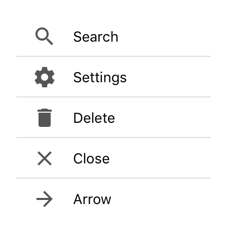

---
---
# CollectionView

Extends [Widget](Widget.md)

A scrollable list that displays data items in cells, one per row. Cells are created on demand by the *createCell* callback and reused on scrolling.

Import this type with "`const {CollectionView} = require('tabris');`"

Android | iOS
--- | ---
 | 

## Methods

### insert(index, count)

**Parameters:** 

- index: *number*
- count: *number* [**Optional**]
  - the position to insert the items at. A negative index is interpreted as relative to the end. If the given index is greater than the item count, new items will be appended at the end.

Inserts one or more items at the given index. When no *count* is specified, a single item will be added at the given *index*. New cells may be created if needed. The `updateCell` callback will only be called for those new items that become immediately visible. Note that inserting new items changes the index of all subsequent items. This operation will update the `itemCount` property.

### load(itemCount)

**Parameters:** 

- itemCount: *number*
  - the number of items in the model to load.

Loads a new model with the given *itemCount*. This operation will update the `itemCount` property.

### refresh(index)

**Parameters:** 

- index: *number* [**Optional**]
  - the index of the item that was changed.

Triggers an update of the item at the given *index* by calling the `updateCell` callback of the corresponding. If no *index* is given, all visible items will be updated.

### remove(index, count)

**Parameters:** 

- index: *number*
  - the index of the first item to remove. A negative value is interpreted as relative to the end.
- count: *number* [**Optional**]
  - the number of items to remove.

Removes one or more items beginning with the given index. When no *count* is given, only the item at *index* will be removed. Note that this changes the index of all subsequent items, however. This operation will update the `itemCount` property.

### reveal(index)

**Parameters:** 

- index: *number*
  - the index of the item to reveal. If this is negative, it is interpreted as relative to the end

Scrolls the item with the given index into view.


## Properties

### cellHeight

Type: *number|"auto"|((index: number, cellType: string) => number)*, default: `auto`

The height of a collection cell. If set to `"auto"`, the cell height will be calculated individually for each cell. If set to a function, this function will be called for every item, providing the item index and the cell type as parameters, and must return the cell height for the given item.

### cellType

Type: *string|((index: number) => string)*

The name of the cell type to use for the item at the given index. This name will be passed to the `createCell` and `cellHeight` callbacks. Cells will be reused only for those items that map to the same cell type. If set to a function, this function will be called for every item, providing the item index as a parameter, and must return a unique name for the cell type to use for the given item.

### columnCount

Type: *number*, default: `1`

The number of columns to display in the collection view. If set to a value `n > 1`, each row will contain `n` items. The available space will be equally distributed between columns.

### createCell

Type: *(cellType: string) => Widget*

A callback used to create a new reusable cell widget for a given type. This callback will be called by the framework and the created cell will be reused for different items. The created widget should be populated in the `updateCell` function.<br/>This property can only be set on widget creation. Once set, it cannot be changed anymore.

### firstVisibleIndex

**read-only**<br/>
Type: *number*

The index of the first item that is currently visible on screen.

### itemCount

Type: *number*

The number of items to display. To add or remove items later, use the methods `insert()` and `remove()` instead of setting the `itemCount`. To display a new list of items, use the `load()` method.

### lastVisibleIndex

**read-only**<br/>
Type: *number*

The index of the last item that is currently visible on screen.

### refreshEnabled

Type: *boolean*, default: `false`

Enables the user to trigger a refresh by using the pull-to-refresh gesture.

### refreshIndicator

Type: *boolean*, default: `false`

Whether the refresh indicator is currently visible. Will be set to `true` when a *refresh* event is triggered. Reset it to `false` when the refresh is finished.

### refreshMessage

Type: *string*, default: `""`

The message text displayed together with the refresh indicator. Currently not supported on Android.

### updateCell

Type: *(cell: Widget, index: number) => void*

A callback used to update a given cell widget to display the item with the given index. This callback will be called by the framework.<br/>This property can only be set on widget creation. Once set, it cannot be changed anymore.


## Events

### cellHeightChanged

Fired when the [*cellHeight*](#cellHeight) property has changed.

#### Event Parameters 

- **target**: *this*
    The widget the event was fired on.

- **value**: *number|"auto"|((index: number, cellType: string) => number)*
    The new value of [*cellHeight*](#cellHeight).


### cellTypeChanged

Fired when the [*cellType*](#cellType) property has changed.

#### Event Parameters 

- **target**: *this*
    The widget the event was fired on.

- **value**: *string|((index: number) => string)*
    The new value of [*cellType*](#cellType).


### columnCountChanged

Fired when the [*columnCount*](#columnCount) property has changed.

#### Event Parameters 

- **target**: *this*
    The widget the event was fired on.

- **value**: *number*
    The new value of [*columnCount*](#columnCount).


### firstVisibleIndexChanged

Fired when the [*firstVisibleIndex*](#firstVisibleIndex) property has changed.

#### Event Parameters 

- **target**: *this*
    The widget the event was fired on.

- **value**: *number*
    The new value of [*firstVisibleIndex*](#firstVisibleIndex).


### itemCountChanged

Fired when the [*itemCount*](#itemCount) property has changed.

#### Event Parameters 

- **target**: *this*
    The widget the event was fired on.

- **value**: *number*
    The new value of [*itemCount*](#itemCount).


### lastVisibleIndexChanged

Fired when the [*lastVisibleIndex*](#lastVisibleIndex) property has changed.

#### Event Parameters 

- **target**: *this*
    The widget the event was fired on.

- **value**: *number*
    The new value of [*lastVisibleIndex*](#lastVisibleIndex).


### refresh

Fired when the user requested a refresh. An event listener should reset the *refreshIndicator* property when refresh is finished.
### refreshEnabledChanged

Fired when the [*refreshEnabled*](#refreshEnabled) property has changed.

#### Event Parameters 

- **target**: *this*
    The widget the event was fired on.

- **value**: *boolean*
    The new value of [*refreshEnabled*](#refreshEnabled).


### refreshIndicatorChanged

Fired when the [*refreshIndicator*](#refreshIndicator) property has changed.

#### Event Parameters 

- **target**: *this*
    The widget the event was fired on.

- **value**: *boolean*
    The new value of [*refreshIndicator*](#refreshIndicator).


### refreshMessageChanged

Fired when the [*refreshMessage*](#refreshMessage) property has changed.

#### Event Parameters 

- **target**: *this*
    The widget the event was fired on.

- **value**: *string*
    The new value of [*refreshMessage*](#refreshMessage).


### scroll

Fired while the collection view is scrolling.

#### Event Parameters 

- **target**: *this*
    The widget the event was fired on.

- **deltaX**: *number*
    Currently always 0.

- **deltaY**: *number*
    The delta of the scroll position. Positive when scrolling up and negative when scrolling down.


### select

Fired when a cell is selected.

#### Event Parameters 

- **target**: *this*
    The widget the event was fired on.

- **index**: *number*
    The index of the selected item.


## Example

```js
// Create a collection view, initialize its cells and fill it with items
const {CollectionView, Composite, ImageView, TextView, ui} = require('tabris');
const IMAGE_PATH = 'images/';

let people = [
  ['Holger', 'Staudacher', 'holger.jpg'],
  ['Ian', 'Bull', 'ian.jpg'],
  ['Jochen', 'Krause', 'jochen.jpg'],
  ['Jordi', 'Böhme López', 'jordi.jpg'],
  ['Markus', 'Knauer', 'markus.jpg'],
  ['Moritz', 'Post', 'moritz.jpg'],
  ['Ralf', 'Sternberg', 'ralf.jpg'],
  ['Tim', 'Buschtöns', 'tim.jpg']
].map(([firstName, lastName, image]) => ({firstName, lastName, image: IMAGE_PATH + image}));

new CollectionView({
  left: 0, top: 0, right: 0, bottom: 0,
  itemCount: people.length,
  cellHeight: 256,
  createCell: () => {
    let cell = new Composite();
    new ImageView({
      top: 16, centerX: 0, width: 200, height: 200
    }).appendTo(cell);
    new TextView({
      left: 30, top: 'prev() 16', right: 30,
      alignment: 'center'
    }).appendTo(cell);
    return cell;
  },
  updateCell: (cell, index) => {
    let person = people[index];
    cell.apply({
      ImageView: {image: person.image},
      TextView: {text: person.firstName}
    });
  }
}).on('select', ({index}) => console.log('selected', people[index].firstName))
  .appendTo(ui.contentView);
```
## See also

- [CollectionView example](https://github.com/eclipsesource/tabris-js/tree/v2.0.0-rc2-dev.20170710+0912/snippets/collectionview.js)
