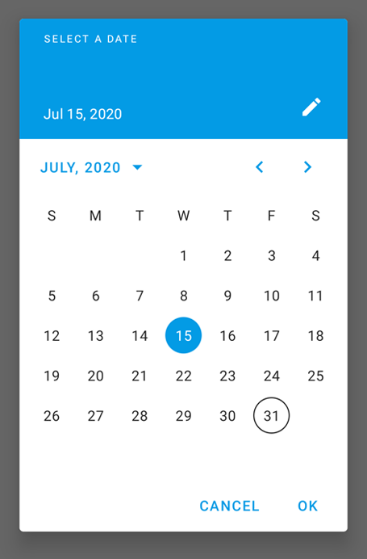
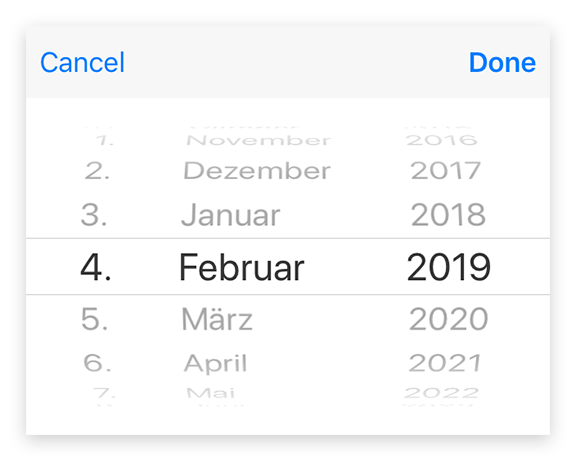

---
---
# Class "DateDialog"

<a href="https://developer.mozilla.org/en-US/docs/Web/JavaScript/Reference/Global_Objects/Object" title="View &quot;Object&quot; on MDN">Object</a> > <a href="NativeObject.html" title="NativeObject Class Reference">NativeObject</a> > <a href="Popup.html" title="Popup Class Reference">Popup</a> > <a href="#" >DateDialog</a>

A `DateDialog` represents a native dialog pop-up allowing the user to pick a date. Properties can only be set before open() is called. The dialog is automatically disposed when closed.


<div class="tabris-image"><figure><div></div><figcaption>Android</figcaption></figure><figure><div></div><figcaption>iOS</figcaption></figure></div>

Type: | <code style="white-space: nowrap">DateDialog extends <a href="Popup.html" title="Popup Class Reference">Popup</a></code>
Constructor: | public
Singleton: | No
Namespace: |<a href="../modules.html#startup" >tabris</a>
Direct subclasses: | None
JSX Support: | Element: <code style="white-space: nowrap"><a href="#" >&lt;DateDialog/&gt;</a></code><br/>Parent Elements: *Not supported*<br/>Child Elements: *Not Supported*<br/>

## Examples
### JavaScript


```js
import {DateDialog} from 'tabris';

new DateDialog()
  .onSelect(({date}) => console.log(`Selected ${date}`))
  .open();
```


See also:
  
[<span class='language jsx'>JSX</span> Creating a simple `DateDialog`](https://playground.tabris.com/?gitref=v3.6.1&snippet=datedialog.jsx)

## Constructor

### new DateDialog(properties?)

Parameter|Type|Description
-|-|-
properties | <code style="white-space: nowrap"><a href="../types.html#propertieswidget" title="Properties&lt;Widget&gt;">Properties</a>&lt;<a href="#" >DateDialog</a>&gt;</code> | Sets all key-value pairs in the properties object as widget properties. *Optional.*

## Static Methods

### open(dateDialog)


Makes the given date dialog visible. Meant to be used with inline-JSX. In TypeScript it also casts the given JSX element from `any` to an actual DateDialog.


Parameter|Type|Description
-|-|-
dateDialog | <code style="white-space: nowrap"><a href="#" >DateDialog</a></code> | The date dialog to open


Returns: <code style="white-space: nowrap"><a href="#" >DateDialog</a></code>

### open(date?)


Creates and opens a date dialog.


Parameter|Type|Description
-|-|-
date | <code style="white-space: nowrap">Date</code> | The date to be displayed in the dialog. The current date is used when no date is provided. *Optional.*


Returns: <code style="white-space: nowrap"><a href="#" >DateDialog</a></code>


## Properties

### date


The date to be displayed in the dialog. The current date is used when no date is provided.

Type: |<code style="white-space: nowrap">Date</code>
Settable: | <a href="../widget-basics.html#widget-properties" >Yes</a>
Change Event: | [`dateChanged`](#datechanged)


### maxDate


Limits the selectable date range to the given future date. No limit is applied when not set.

Type: |<code style="white-space: nowrap">Date</code>
Settable: | <a href="../widget-basics.html#widget-properties" >Yes</a>
Change Event: | [`maxDateChanged`](#maxdatechanged)


### minDate


Limits the selectable date range to the given past date. No limit is applied when not set.

Type: |<code style="white-space: nowrap">Date</code>
Settable: | <a href="../widget-basics.html#widget-properties" >Yes</a>
Change Event: | [`minDateChanged`](#mindatechanged)


## Events

### close

Fired when the date dialog was closed.

EventObject Type: <code style="white-space: nowrap">DateDialogCloseEvent&lt;<a href="#" >DateDialog</a>&gt;</code>

Property|Type|Description
-|-|-
date | <code style="white-space: nowrap">Date &#124; <a href="https://developer.mozilla.org/en-US/docs/Web/JavaScript/Data_structures#Null_type" title="View &quot;null&quot; on MDN">null</a></code> | The selected date. Can be `null` when no date was selected.

### select

Fired when a date was selected by the user.

EventObject Type: <code style="white-space: nowrap">DateDialogSelectEvent&lt;<a href="#" >DateDialog</a>&gt;</code>

Property|Type|Description
-|-|-
date | <code style="white-space: nowrap">Date</code> | The selected date. Only the date components reflect the users selection. The time component values are undefined.

## Change Events

### dateChanged

Fired when the [date](#date) property has changed.

EventObject Type: <code style="white-space: nowrap"><a href="../types.html#propertychangedeventtargettype-valuetype" title="PropertyChangedEvent&lt;TargetType, ValueType&gt;">PropertyChangedEvent</a>&lt;<a href="#" >DateDialog</a>, Date&gt;</code>

Property|Type|Description
-|-|-
value | <code style="white-space: nowrap">Date</code> | The new value of [date](#date).

### minDateChanged

Fired when the [minDate](#mindate) property has changed.

EventObject Type: <code style="white-space: nowrap"><a href="../types.html#propertychangedeventtargettype-valuetype" title="PropertyChangedEvent&lt;TargetType, ValueType&gt;">PropertyChangedEvent</a>&lt;<a href="#" >DateDialog</a>, Date&gt;</code>

Property|Type|Description
-|-|-
value | <code style="white-space: nowrap">Date</code> | The new value of [minDate](#mindate).

### maxDateChanged

Fired when the [maxDate](#maxdate) property has changed.

EventObject Type: <code style="white-space: nowrap"><a href="../types.html#propertychangedeventtargettype-valuetype" title="PropertyChangedEvent&lt;TargetType, ValueType&gt;">PropertyChangedEvent</a>&lt;<a href="#" >DateDialog</a>, Date&gt;</code>

Property|Type|Description
-|-|-
value | <code style="white-space: nowrap">Date</code> | The new value of [maxDate](#maxdate).

