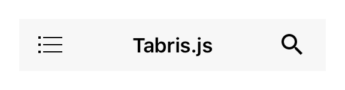

---
---
# Class "NavigationView"

<span style="white-space:nowrap;">[`Object`](https://developer.mozilla.org/en-US/docs/Web/JavaScript/Reference/Global_Objects/Object)</span> > <span style="white-space:nowrap;">[`NativeObject`](NativeObject.md)</span> > <span style="white-space:nowrap;">[`Widget`](Widget.md)</span> > <span style="white-space:nowrap;">[`Composite`](Composite.md)</span> > <span style="white-space:nowrap;">[`NavigationView`](NavigationView.md)</span>

A widget that displays a stack of [pages](Page) with a toolbar that allows to navigate back. The toolbar also displays the current page's title and the highest priority [actions](Action) that are added to the NavigationView. Only children of type `Page`, `Action` and `SearchAction` are supported. Since the NavigationView does not compute its own size, the width and height must be defined by the respective layout properties (e.g. either `width` or `left` and `right` must be specified).


<div class="tabris-image"><figure><div></div><figcaption>Android</figcaption></figure><figure><div></div><figcaption>iOS</figcaption></figure></div>

TypeScript type | `NavigationView<PageType extends Page = Page, ActionType extends Action = Action> extends Composite<PageType|ActionType>`
Constructor | *public*
Singleton | *No*
Namespace |`tabris`
Direct subclasses | *None*
JSX support | Element: `<NavigationView/>`<br/>Parent element: [`<Composite/>`](Composite.md) *and any widget extending* <span style="white-space:nowrap;">[`Composite`](Composite.md)</span><br/>Child elements: `<PageType|ActionType/>`<br/>Text content: *Not supported*<br/>

## Example
```js
import {NavigationView, Page, contentView} from 'tabris';

new NavigationView({layoutData: 'stretch'})
  .append(new Page({title: 'Albums'}))
  .appendTo(contentView);
```

See also:
  
[<span class='language jsx'>JSX</span> Creating a simple `NavigationView` with pages](https://playground.tabris.com/?gitref=v3.1.0&snippet=navigationview-page-stacked.jsx)  
[<span class='language jsx'>JSX</span> Demonstrating a `NavigationView` with various interactive properties](https://playground.tabris.com/?gitref=v3.1.0&snippet=navigationview-properties.jsx)  
[<span class='language js'>JS</span> Using multiple `NavigationViews` in `TabFolder` `Tabs`](https://playground.tabris.com/?gitref=v3.1.0&snippet=navigationview-tabfolder.js)  
[<span class='language jsx'>JSX</span> navigationview-action-placement.jsx](https://playground.tabris.com/?gitref=v3.1.0&snippet=navigationview-action-placement.jsx)  
[<span class='language jsx'>JSX</span> navigationview-action.jsx](https://playground.tabris.com/?gitref=v3.1.0&snippet=navigationview-action.jsx)  
[<span class='language jsx'>JSX</span> navigationview-searchaction.jsx](https://playground.tabris.com/?gitref=v3.1.0&snippet=navigationview-searchaction.jsx)

## Constructor

### new NavigationView(properties?)

Parameter|Type|Optional|Description
-|-|-|-
properties | <span style="white-space:nowrap;">`Properties<NavigationView>`</span> | Yes | Sets all key-value pairs in the properties object as widget properties.

## Methods

### pages(selector?)


Returns the ordered list of pages on the page stack, with the bottommost page as the first and the topmost page as the last element. Same as children(), but only returns children that are of type `Page`.


Parameter|Type|Optional|Description
-|-|-|-
selector | <span style="white-space:nowrap;">[`Selector`](../types.md#selector)</span> | Yes | A selector expression or a predicate function to filter the results.


Returns <span style="white-space:nowrap;">[`WidgetCollection`](WidgetCollection.md)</span>

### pages(constructor)


Returns the ordered list of pages on the page stack, with the bottommost page as the first and the topmost page as the last element. Same as children(), but only accepts subclasses of `Page`.


Parameter|Type|Optional|Description
-|-|-|-
constructor | <span style="white-space:nowrap;">`{ new (...args: any[]): U }`</span> | No | A class to filter the results.


Returns <span style="white-space:nowrap;">`WidgetCollection<U>`</span>


## Properties

### actionColor


The color used for action icons.

Type | <span style="white-space:nowrap;">[`ColorValue`](../types.md#colorvalue)</span>
Settable | *Yes*
Change events | *Yes*


### actionTextColor
<p class="platforms"><span class='android-tag' title='supported on Android'>Android</span></p>

The color used for action texts. Only applied on Android, IOS uses the `actionColor` to colorize the action text.

Type | <span style="white-space:nowrap;">[`ColorValue`](../types.md#colorvalue)</span>
Settable | *Yes*
Change events | *Yes*


### drawerActionVisible


Whether to display the so-called "Burger menu" to open the drawer.

Type | <span style="white-space:nowrap;">[`boolean`](https://developer.mozilla.org/en-US/docs/Web/JavaScript/Data_structures#Boolean_type)</span>
Settable | *Yes*
Change events | *Yes*


### pageAnimation


Controls what animation to use when animating a page transition.

Type | `'default'` \| `'none'`
Default | `'default'`
Settable | *Yes*
Change events | *Yes*


### titleTextColor


The text color used for page titles.

Type | <span style="white-space:nowrap;">[`ColorValue`](../types.md#colorvalue)</span>
Settable | *Yes*
Change events | *Yes*


### toolbarColor


The background color of the toolbar.

Type | <span style="white-space:nowrap;">[`ColorValue`](../types.md#colorvalue)</span>
Settable | *Yes*
Change events | *Yes*


### toolbarHeight


The height of the toolbar. Is 0 if not visible.

Type | <span style="white-space:nowrap;">[`number`](https://developer.mozilla.org/en-US/docs/Web/JavaScript/Data_structures#Number_type)</span>
Settable | *Yes*
Change events | *Yes*


### toolbarVisible


Whether the toolbar is visible.

Type | <span style="white-space:nowrap;">[`boolean`](https://developer.mozilla.org/en-US/docs/Web/JavaScript/Data_structures#Boolean_type)</span>
Default | `true`
Settable | *Yes*
Change events | *Yes*


## Change Events

### drawerActionVisibleChanged

Fired when the [*drawerActionVisible*](#draweractionvisible) property has changed.

Parameter|Type|Description
-|-|-
value | <span style="white-space:nowrap;">[`boolean`](https://developer.mozilla.org/en-US/docs/Web/JavaScript/Data_structures#Boolean_type)</span> | The new value of [*drawerActionVisible*](#draweractionvisible).

### toolbarVisibleChanged

Fired when the [*toolbarVisible*](#toolbarvisible) property has changed.

Parameter|Type|Description
-|-|-
value | <span style="white-space:nowrap;">[`boolean`](https://developer.mozilla.org/en-US/docs/Web/JavaScript/Data_structures#Boolean_type)</span> | The new value of [*toolbarVisible*](#toolbarvisible).

### toolbarColorChanged

Fired when the [*toolbarColor*](#toolbarcolor) property has changed.

Parameter|Type|Description
-|-|-
value | <span style="white-space:nowrap;">[`ColorValue`](../types.md#colorvalue)</span> | The new value of [*toolbarColor*](#toolbarcolor).

### toolbarHeightChanged

Fired when the height of the toolbar changes, e.g. if it changes visibility.

Parameter|Type|Description
-|-|-
value | <span style="white-space:nowrap;">[`number`](https://developer.mozilla.org/en-US/docs/Web/JavaScript/Data_structures#Number_type)</span> | The new value of [*toolbarHeight*](#toolbarheight).

### titleTextColorChanged

Fired when the [*titleTextColor*](#titletextcolor) property has changed.

Parameter|Type|Description
-|-|-
value | <span style="white-space:nowrap;">[`ColorValue`](../types.md#colorvalue)</span> | The new value of [*titleTextColor*](#titletextcolor).

### actionColorChanged

Fired when the [*actionColor*](#actioncolor) property has changed.

Parameter|Type|Description
-|-|-
value | <span style="white-space:nowrap;">[`ColorValue`](../types.md#colorvalue)</span> | The new value of [*actionColor*](#actioncolor).

### actionTextColorChanged

Fired when the [*actionTextColor*](#actiontextcolor) property has changed.

Parameter|Type|Description
-|-|-
value | <span style="white-space:nowrap;">[`ColorValue`](../types.md#colorvalue)</span> | The new value of [*actionTextColor*](#actiontextcolor).

### pageAnimationChanged

Fired when the [*pageAnimation*](#pageanimation) property has changed.

Parameter|Type|Description
-|-|-
value | <span style="white-space:nowrap;">[`string`](https://developer.mozilla.org/en-US/docs/Web/JavaScript/Data_structures#String_type)</span> | The new value of [*pageAnimation*](#pageanimation).

