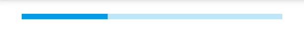
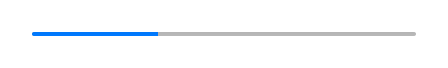

---
---
# ProgressBar

A widget representing a numeric value as a horizontal bar with a growing indicator.

Android | iOS
--- | ---
 | 

Extends [Widget](Widget.md)

## Properties

### maximum

Type: *number*, default: `100`

The value that represents a progress of 100%.

### minimum

Type: *number*, default: `0`

The value that represents a progress of 0%.

### selection

Type: *number*, default: `0`

The actual progress to be displayed.

### state

Type: *string*, supported values: `normal`, `paused`, `error`, default: `normal`

This property affects the color of the progress indicator. Not supported on iOS.


## Example
```js
// A progress bar that is animated using a timer

var progressBar = new tabris.ProgressBar({
  left: 15, right: 15, centerY: 0,
  maximum: 300,
  selection: 100
}).appendTo(tabris.ui.contentView);

setInterval(function() {
  var selection = progressBar.selection + 1;
  progressBar.selection = selection > 300 ? 0 : selection;
}, 20);
```
## See also

- [Simple ProgressBar snippet](https://github.com/eclipsesource/tabris-js/tree/v2.0.0-beta2/snippets/progressbar.js)
