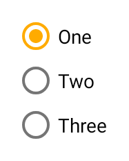

---
---
# RadioButton

Extends [Widget](Widget.md)

A radio button. Selecting a radio button de-selects all its siblings (i.e. all radio buttons within the same parent).

Import this type with "`const {RadioButton} = require('tabris');`"

Android | iOS
--- | ---
 | 

## Properties

### checked


Type: *boolean*, default: `false`

The checked state of the radio button.

### checkedTintColor
<p class="platforms"><span class="ios-tag" title="supported on iOS">iOS</span><span class="android-tag" title="supported on Android">Android</span></p>

Type: *[Color](../types.md#color)*

The color of the selectable area in checked state. Will fall back to `tintColor` if not set.

### text


Type: *string*

The label text of the radio button.

### textColor


Type: *[Color](../types.md#color)*

The color of the text.

### tintColor
<p class="platforms"><span class="ios-tag" title="supported on iOS">iOS</span><span class="android-tag" title="supported on Android">Android</span></p>

Type: *[Color](../types.md#color)*

The color of the selectable area.


## Events

### checkedChanged

Fired when the [*checked*](#checked) property has changed.

#### Event Parameters 
- **target**: *this*
    The widget the event was fired on.

- **value**: *boolean*
    The new value of [*checked*](#checked).


### checkedTintColorChanged

Fired when the [*checkedTintColor*](#checkedTintColor) property has changed.

#### Event Parameters 
- **target**: *this*
    The widget the event was fired on.

- **value**: *[Color](../types.md#color)*
    The new value of [*checkedTintColor*](#checkedTintColor).


### select

Fired when the radio button is selected or deselected by the user.

#### Event Parameters 
- **target**: *this*
    The widget the event was fired on.

- **checked**: *boolean*
    The new value of *[checked](#checked)*.


### textChanged

Fired when the [*text*](#text) property has changed.

#### Event Parameters 
- **target**: *this*
    The widget the event was fired on.

- **value**: *string*
    The new value of [*text*](#text).


### textColorChanged

Fired when the [*textColor*](#textColor) property has changed.

#### Event Parameters 
- **target**: *this*
    The widget the event was fired on.

- **value**: *[Color](../types.md#color)*
    The new value of [*textColor*](#textColor).


### tintColorChanged

Fired when the [*tintColor*](#tintColor) property has changed.

#### Event Parameters 
- **target**: *this*
    The widget the event was fired on.

- **value**: *[Color](../types.md#color)*
    The new value of [*tintColor*](#tintColor).


## Example
```js
const {RadioButton, ui} = require('tabris');

// Create radio buttons with checked handlers

['One', 'Two', 'Three'].forEach((title) => {
  new RadioButton({
    left: 10, top: 'prev() 10',
    text: title
  }).on('checkedChanged', ({target, value: checked}) => {
    if (checked) {
      console.log(target.text + ' checked');
    }
  }).appendTo(ui.contentView);
});
```
## See also

- [Simple RadioButton snippet](https://github.com/eclipsesource/tabris-js/tree/v2.1.0/snippets/radiobutton.js)
