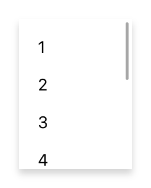

# ScrollView

A composite that allows its content to overflow either vertically (default) or horizontally. Since the ScrollView does not compute its own size, the width and height must be defined by the respective layout properties (e.g. either `width` or `left` and `right` must be specified).

Android | iOS
--- | ---
 | 

Extends [Composite](Composite.md)

## Methods

### scrollToX(offset)

**Parameters:** 

- offset: *number*, the offset to scroll to in dip.

**Returns:** *this*

Scrolls to the given horizontal offset using an animation. Has no effect on a vertical `ScrollView`

### scrollToX(offset, options)

**Parameters:** 

- offset: *number*, the offset to scroll to in dip.
- options: *{animate?: boolean}*, an additional object to control the animation. Set `{animate: false}` to scroll without an animation.

**Returns:** *this*

Scrolls to the given horizontal offset. Give `{animate: false}` as the second parameter to suppress the animation.

### scrollToY(offsetY)

**Parameters:** 

- offsetY: *number*, the offset to scroll to in dip.

**Returns:** *this*

Scrolls to the given vertical offset using an animation. Has no effect on a horizontal `ScrollView`

### scrollToY(offsetY, options)

**Parameters:** 

- offsetY: *number*, the offset to scroll to in dip.
- options: *{animate?: boolean}*, an additional object to control the animation. Set `{animate: false}` to scroll without an animation.

**Returns:** *this*

Scrolls to the given vertical offset. Give `{animate: false}` as the second parameter to suppress the animation.


## Properties

### direction

Type: *string*, supported values: `vertical`, `horizontal`, default: `vertical`

Specifies the scrolling direction of the scroll composite.<br/>This property can only be set on widget creation. Once set, it cannot be changed anymore.

### offsetX

**read-only**<br/>
Type: *number*

The horizontal scrolling position in dip.

### offsetY

**read-only**<br/>
Type: *number*

The vertical scrolling position in dip.


## Events

### scrollX
Fired while scrolling horizontally.

#### Event Parameters 
- **target**: *this*
    The widget the event was fired on.

- **offset**: *number*
    Indicates the current horizontal scrolling position.


### scrollY
Fired while scrolling vertically.

#### Event Parameters 
- **target**: *this*
    The widget the event was fired on.

- **offset**: *number*
    Indicates the current vertical scrolling position.


## Example
```js
// Create a horizontal scroll view and populate it with text views

var scrollView = new tabris.ScrollView({
  left: 0, right: 0, top: '40%', bottom: '40%',
  direction: 'horizontal',
  background: '#234'
}).appendTo(tabris.ui.contentView);

for (var i = 0; i <= 50; i++) {
  new tabris.TextView({
    left: i * 30 + 20, centerY: 0, width: 30,
    textColor: 'white',
    text: i + '°'
  }).appendTo(scrollView);
}

new tabris.Button({
  left: 16, bottom: 16,
  text: 'scroll'
}).on('select', function() {
  scrollView.scrollToX(310);
}).appendTo(tabris.ui.contentView);
```
## See also

- [Simple ScrollView snippet](https://github.com/eclipsesource/tabris-js/tree/v2.0.0-beta2/snippets/scrollview.js)
- [Example using a ScrollView](https://github.com/eclipsesource/tabris-js/tree/v2.0.0-beta2/examples/parallax/parallax.js)
