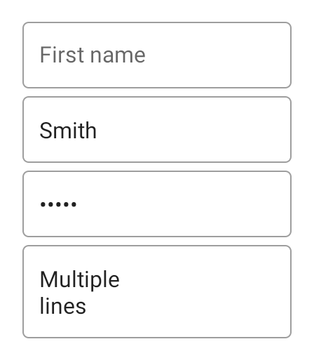
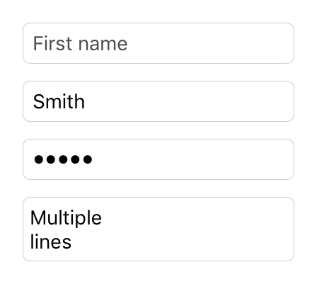

---
---
# Class "TextInput"

<a href="https://developer.mozilla.org/en-US/docs/Web/JavaScript/Reference/Global_Objects/Object" title="View &quot;Object&quot; on MDN">Object</a> > <a href="NativeObject.html" title="NativeObject Class Reference">NativeObject</a> > <a href="Widget.html" title="Widget Class Reference">Widget</a> > <a href="#" >TextInput</a>

A widget that allows to enter text.


<div class="tabris-image"><figure><div></div><figcaption>Android</figcaption></figure><figure><div></div><figcaption>iOS</figcaption></figure></div>

Type: | <code style="white-space: nowrap">TextInput extends <a href="Widget.html" title="Widget Class Reference">Widget</a></code>
Constructor: | public
Singleton: | No
Namespace: |<a href="../modules.html#startup" >tabris</a>
Direct subclasses: | None
JSX Support: | Element: <code style="white-space: nowrap"><a href="#" >&lt;TextInput/&gt;</a></code><br/>Parent Elements: <code style="white-space: nowrap"><a href="Canvas.html" title="Canvas Class Reference">&lt;Canvas/&gt;</a></code>, <code style="white-space: nowrap"><a href="Cell.html" title="Cell Class Reference">&lt;Cell/&gt;</a></code>, <code style="white-space: nowrap"><a href="Composite.html" title="Composite Class Reference">&lt;Composite/&gt;</a></code>, <code style="white-space: nowrap"><a href="Page.html" title="Page Class Reference">&lt;Page/&gt;</a></code>, <code style="white-space: nowrap"><a href="RefreshComposite.html" title="RefreshComposite Class Reference">&lt;RefreshComposite/&gt;</a></code>, <code style="white-space: nowrap"><a href="Row.html" title="Row Class Reference">&lt;Row/&gt;</a></code>, <code style="white-space: nowrap"><a href="ScrollView.html" title="ScrollView Class Reference">&lt;ScrollView/&gt;</a></code>, <code style="white-space: nowrap"><a href="Stack.html" title="Stack Class Reference">&lt;Stack/&gt;</a></code>, <code style="white-space: nowrap"><a href="Tab.html" title="Tab Class Reference">&lt;Tab/&gt;</a></code><br/>Child Elements: *Not Supported*<br/>Element content sets: [<code style="white-space: nowrap">text</code>](#text)

## Examples
### JavaScript


```js
import {TextInput, contentView} from 'tabris';

new TextInput({
  left: 16, right: 16,
  message: 'Name'
}).onInput(({text}) => console.log(`Text changed to ${text}`))
  .appendTo(contentView);
```


See also:
  
[<span class='language jsx'>JSX</span> Creating a simple `TextInput`](https://playground.tabris.com/?gitref=v3.6.0&snippet=textinput.jsx)  
[<span class='language js'>JS</span> Handling selection on a `TextInput`](https://playground.tabris.com/?gitref=v3.6.0&snippet=textinput-selection.js)  
[<span class='language jsx'>JSX</span> Handling focus changes on a `TextInput`](https://playground.tabris.com/?gitref=v3.6.0&snippet=textinput.jsx)  
[<span class='language js'>JS</span> Creating `TextInputs` with various enter key types](https://playground.tabris.com/?gitref=v3.6.0&snippet=textinput-enterkeytype.js)  
[<span class='language js'>JS</span> Creating `TextInputs` with various keyboards](https://playground.tabris.com/?gitref=v3.6.0&snippet=textinput-keyboard.js)  
[<span class='language js'>JS</span> Showing password in clear text on a `TextInput`](https://playground.tabris.com/?gitref=v3.6.0&snippet=textinput-revealpassword.js)  
[<span class='language jsx'>JSX</span> A form using `TextInput` and other input controls](https://playground.tabris.com/?gitref=v3.6.0&snippet=input.jsx)  
[<span class='language tsx'>TSX</span> textinput-focus.tsx](https://playground.tabris.com/?gitref=v3.6.0&snippet=textinput-focus.tsx)  
[<span class='language ts'>TS</span> textinput-keyboard.ts](https://playground.tabris.com/?gitref=v3.6.0&snippet=textinput-keyboard.ts)  
[<span class='language tsx'>TSX</span> textinput-style.tsx](https://playground.tabris.com/?gitref=v3.6.0&snippet=textinput-style.tsx)

## Constructor

### new TextInput(properties?)

Parameter|Type|Description
-|-|-
properties | <code style="white-space: nowrap"><a href="../types.html#propertieswidget" title="Properties&lt;Widget&gt;">Properties</a>&lt;<a href="#" >TextInput</a>&gt;</code> | Sets all key-value pairs in the properties object as widget properties. *Optional.*

## Properties

### alignment


The horizontal alignment of the text.

Type: |<code style="white-space: nowrap"><a href="https://developer.mozilla.org/en-US/docs/Web/JavaScript/Data_structures#String_type" title="View &quot;string&quot; on MDN">'left'</a> &#124; <a href="https://developer.mozilla.org/en-US/docs/Web/JavaScript/Data_structures#String_type" title="View &quot;string&quot; on MDN">'right'</a> &#124; <a href="https://developer.mozilla.org/en-US/docs/Web/JavaScript/Data_structures#String_type" title="View &quot;string&quot; on MDN">'centerX'</a></code>
Default: | <code style="white-space: nowrap"><a href="https://developer.mozilla.org/en-US/docs/Web/JavaScript/Data_structures#String_type" title="View &quot;string&quot; on MDN">'left'</a></code>
Settable: | <a href="../widget-basics.html#widget-properties" >Yes</a>
Change Event: | [`alignmentChanged`](#alignmentchanged)


### autoCapitalize


Control how text input is capitalized.

* `none` - Do not change any text input
* `sentence` - Capitalize the first word of a sentence
* `word` - Capitalize every word
* `all` - Capitalize every letter

The boolean value `false` maps to `none` whereas `true` is equal to `all`.

Type: |<code style="white-space: nowrap"><a href="https://developer.mozilla.org/en-US/docs/Web/JavaScript/Data_structures#Boolean_type" title="View &quot;boolean&quot; on MDN">true</a> &#124; <a href="https://developer.mozilla.org/en-US/docs/Web/JavaScript/Data_structures#Boolean_type" title="View &quot;boolean&quot; on MDN">false</a> &#124; <a href="https://developer.mozilla.org/en-US/docs/Web/JavaScript/Data_structures#String_type" title="View &quot;string&quot; on MDN">none</a> &#124; <a href="https://developer.mozilla.org/en-US/docs/Web/JavaScript/Data_structures#String_type" title="View &quot;string&quot; on MDN">sentence</a> &#124; <a href="https://developer.mozilla.org/en-US/docs/Web/JavaScript/Data_structures#String_type" title="View &quot;string&quot; on MDN">word</a> &#124; <a href="https://developer.mozilla.org/en-US/docs/Web/JavaScript/Data_structures#String_type" title="View &quot;string&quot; on MDN">all</a></code>
Default: | <code style="white-space: nowrap"><a href="https://developer.mozilla.org/en-US/docs/Web/JavaScript/Data_structures#Boolean_type" title="View &quot;boolean&quot; on MDN">false</a></code>
Settable: | <a href="../widget-basics.html#widget-properties" >Yes</a>
Change Event: | [`autoCapitalizeChanged`](#autocapitalizechanged)


### autoCorrect


Enables the spell checker and auto-correction feature.

Type: |<code style="white-space: nowrap"><a href="https://developer.mozilla.org/en-US/docs/Web/JavaScript/Data_structures#Boolean_type" title="View &quot;boolean&quot; on MDN">boolean</a></code>
Default: | <code style="white-space: nowrap"><a href="https://developer.mozilla.org/en-US/docs/Web/JavaScript/Data_structures#String_type" title="View &quot;string&quot; on MDN">false</a></code>
Settable: | <a href="../widget-basics.html#widget-properties" >Yes</a>
Change Event: | [`autoCorrectChanged`](#autocorrectchanged)


### borderColor


The color of the border of the TextInput. On iOS this is a rectangular border around the TextInput, on Android it is a single line below the TextInput.

Type: |<code style="white-space: nowrap"><a href="../types.html#colorvalue" title="ColorValue Type Reference">ColorValue</a></code>
Settable: | <a href="../widget-basics.html#widget-properties" >Yes</a>
Change Event: | [`borderColorChanged`](#bordercolorchanged)


### cursorColor
<p class="platforms"><span class='ios-tag' title='supported on iOS'>iOS</span></p>

The color of the cursor in the `TextInput`.

Type: |<code style="white-space: nowrap"><a href="../types.html#colorvalue" title="ColorValue Type Reference">ColorValue</a></code>
Settable: | <a href="../widget-basics.html#widget-properties" >Yes</a>
Change Event: | [`cursorColorChanged`](#cursorcolorchanged)


### editable


Whether the text can be edited or not.

Type: |<code style="white-space: nowrap"><a href="https://developer.mozilla.org/en-US/docs/Web/JavaScript/Data_structures#Boolean_type" title="View &quot;boolean&quot; on MDN">boolean</a></code>
Default: | <code style="white-space: nowrap"><a href="https://developer.mozilla.org/en-US/docs/Web/JavaScript/Data_structures#String_type" title="View &quot;string&quot; on MDN">true</a></code>
Settable: | <a href="../widget-basics.html#widget-properties" >Yes</a>
Change Event: | [`editableChanged`](#editablechanged)


### enterKeyType


Label or icon to display on the keyboard 'confirmation' key. The key press can be captured via the `accept` event. Setting an `enterKeyType` other than `default` will change the key behavior to not close the keyboard automatically. The developer is able close the keyboard by removing the focus from the `TextInput`.

Type: |<code style="white-space: nowrap"><a href="https://developer.mozilla.org/en-US/docs/Web/JavaScript/Data_structures#String_type" title="View &quot;string&quot; on MDN">'default'</a> &#124; <a href="https://developer.mozilla.org/en-US/docs/Web/JavaScript/Data_structures#String_type" title="View &quot;string&quot; on MDN">'done'</a> &#124; <a href="https://developer.mozilla.org/en-US/docs/Web/JavaScript/Data_structures#String_type" title="View &quot;string&quot; on MDN">'next'</a> &#124; <a href="https://developer.mozilla.org/en-US/docs/Web/JavaScript/Data_structures#String_type" title="View &quot;string&quot; on MDN">'send'</a> &#124; <a href="https://developer.mozilla.org/en-US/docs/Web/JavaScript/Data_structures#String_type" title="View &quot;string&quot; on MDN">'search'</a> &#124; <a href="https://developer.mozilla.org/en-US/docs/Web/JavaScript/Data_structures#String_type" title="View &quot;string&quot; on MDN">'go'</a></code>
Default: | <code style="white-space: nowrap"><a href="https://developer.mozilla.org/en-US/docs/Web/JavaScript/Data_structures#String_type" title="View &quot;string&quot; on MDN">'default'</a></code>
Settable: | <a href="../widget-basics.html#widget-properties" >Yes</a>
Change Event: | [`enterKeyTypeChanged`](#enterkeytypechanged)


See also:
  
[<span class='language js'>JS</span> textinput-enterkeytype.js](https://playground.tabris.com/?gitref=v3.6.0&snippet=textinput-enterkeytype.js)


### floatMessage
<p class="platforms"><span class='android-tag' title='supported on Android'>Android</span></p>

Should the hint message float above the TextInput when focus is gained.

Type: |<code style="white-space: nowrap"><a href="https://developer.mozilla.org/en-US/docs/Web/JavaScript/Data_structures#Boolean_type" title="View &quot;boolean&quot; on MDN">boolean</a></code>
Default: | <code style="white-space: nowrap"><a href="https://developer.mozilla.org/en-US/docs/Web/JavaScript/Data_structures#String_type" title="View &quot;string&quot; on MDN">true</a></code>
Settable: | <a href="../widget-basics.html#widget-properties" >Yes</a>
Change Event: | [`floatMessageChanged`](#floatmessagechanged)


### focused


Reflects whether this widget has the keyboard focus. Setting this property to `true` will focus the widget and open the virtual keyboard, setting it to `false` will remove the focus and hide the virtual keyboard.

Type: |<code style="white-space: nowrap"><a href="https://developer.mozilla.org/en-US/docs/Web/JavaScript/Data_structures#Boolean_type" title="View &quot;boolean&quot; on MDN">boolean</a></code>
Default: | <code style="white-space: nowrap"><a href="https://developer.mozilla.org/en-US/docs/Web/JavaScript/Data_structures#String_type" title="View &quot;string&quot; on MDN">false</a></code>
Settable: | <a href="../widget-basics.html#widget-properties" >Yes</a>
Change Event: | [`focusedChanged`](#focusedchanged)


### font


The font used for the text.

Type: |<code style="white-space: nowrap"><a href="../types.html#fontvalue" title="FontValue Type Reference">FontValue</a></code>
Settable: | <a href="../widget-basics.html#widget-properties" >Yes</a>
Change Event: | [`fontChanged`](#fontchanged)


### keepFocus


When `true` the `TextInput` will keep its focus, even when tapped outside of the widget bounds.

Type: |<code style="white-space: nowrap"><a href="https://developer.mozilla.org/en-US/docs/Web/JavaScript/Data_structures#Boolean_type" title="View &quot;boolean&quot; on MDN">boolean</a></code>
Default: | <code style="white-space: nowrap"><a href="https://developer.mozilla.org/en-US/docs/Web/JavaScript/Data_structures#String_type" title="View &quot;string&quot; on MDN">false</a></code>
Settable: | <a href="../widget-basics.html#widget-properties" >Yes</a>
Change Event: | [`keepFocusChanged`](#keepfocuschanged)


### keyboard


Selects the keyboard type to use for editing this widget. Has no effect when `type` is set to `multiline`.

Type: |<code style="white-space: nowrap"><a href="https://developer.mozilla.org/en-US/docs/Web/JavaScript/Data_structures#String_type" title="View &quot;string&quot; on MDN">'ascii'</a> &#124; <a href="https://developer.mozilla.org/en-US/docs/Web/JavaScript/Data_structures#String_type" title="View &quot;string&quot; on MDN">'decimal'</a> &#124; <a href="https://developer.mozilla.org/en-US/docs/Web/JavaScript/Data_structures#String_type" title="View &quot;string&quot; on MDN">'email'</a> &#124; <a href="https://developer.mozilla.org/en-US/docs/Web/JavaScript/Data_structures#String_type" title="View &quot;string&quot; on MDN">'number'</a> &#124; <a href="https://developer.mozilla.org/en-US/docs/Web/JavaScript/Data_structures#String_type" title="View &quot;string&quot; on MDN">'numbersAndPunctuation'</a> &#124; <a href="https://developer.mozilla.org/en-US/docs/Web/JavaScript/Data_structures#String_type" title="View &quot;string&quot; on MDN">'phone'</a> &#124; <a href="https://developer.mozilla.org/en-US/docs/Web/JavaScript/Data_structures#String_type" title="View &quot;string&quot; on MDN">'url'</a> &#124; <a href="https://developer.mozilla.org/en-US/docs/Web/JavaScript/Data_structures#String_type" title="View &quot;string&quot; on MDN">'default'</a></code>
Default: | <code style="white-space: nowrap"><a href="https://developer.mozilla.org/en-US/docs/Web/JavaScript/Data_structures#String_type" title="View &quot;string&quot; on MDN">'default'</a></code>
Settable: | <a href="../widget-basics.html#widget-properties" >Yes</a>
Change Event: | [`keyboardChanged`](#keyboardchanged)


See also:
  
[<span class='language js'>JS</span> textinput-keyboard.js](https://playground.tabris.com/?gitref=v3.6.0&snippet=textinput-keyboard.js)  
[<span class='language ts'>TS</span> textinput-keyboard.ts](https://playground.tabris.com/?gitref=v3.6.0&snippet=textinput-keyboard.ts)


### keyboardAppearanceMode
<p class="platforms"><span class='android-tag' title='supported on Android'>Android</span></p>

Allows to control when to show the virtual keyboard.

- `'never'` - The keyboard is never shown when focus is gained.

- `'ontouch'` - The keyboard is not shown when the `focused` property is set to `true` programmatically. Only the blinking cursor will be shown. Touching the `TextInput` will show the keyboard.

- `'onfocus'` - The keyboard is always shown when the `TextInput` gains focus.

Type: |<code style="white-space: nowrap"><a href="https://developer.mozilla.org/en-US/docs/Web/JavaScript/Data_structures#String_type" title="View &quot;string&quot; on MDN">'never'</a><br/>&#124; <a href="https://developer.mozilla.org/en-US/docs/Web/JavaScript/Data_structures#String_type" title="View &quot;string&quot; on MDN">'ontouch'</a><br/>&#124; <a href="https://developer.mozilla.org/en-US/docs/Web/JavaScript/Data_structures#String_type" title="View &quot;string&quot; on MDN">'onfocus'</a></code>
Default: | <code style="white-space: nowrap"><a href="https://developer.mozilla.org/en-US/docs/Web/JavaScript/Data_structures#String_type" title="View &quot;string&quot; on MDN">'onfocus'</a></code>
Settable: | <a href="../widget-basics.html#widget-properties" >Yes</a>
Change Event: | [`keyboardAppearanceModeChanged`](#keyboardappearancemodechanged)


### maxChars


The maximum number of characters that can be entered into a `TextInput`.

Type: |<code style="white-space: nowrap"><a href="https://developer.mozilla.org/en-US/docs/Web/JavaScript/Data_structures#Number_type" title="View &quot;number&quot; on MDN">number</a></code>
Default: | <code style="white-space: nowrap"><a href="https://developer.mozilla.org/en-US/docs/Web/JavaScript/Data_structures#String_type" title="View &quot;string&quot; on MDN">null</a></code>
Settable: | <a href="../widget-basics.html#widget-properties" >Yes</a>
Change Event: | [`maxCharsChanged`](#maxcharschanged)


### message


A hint text that is displayed when the input field is empty. Does not apply on iOS when `type` is set to `multiline`.

Type: |<code style="white-space: nowrap"><a href="https://developer.mozilla.org/en-US/docs/Web/JavaScript/Data_structures#String_type" title="View &quot;string&quot; on MDN">string</a></code>
Settable: | <a href="../widget-basics.html#widget-properties" >Yes</a>
Change Event: | [`messageChanged`](#messagechanged)


### messageColor


Color of the `message` text.

Type: |<code style="white-space: nowrap"><a href="../types.html#colorvalue" title="ColorValue Type Reference">ColorValue</a></code>
Settable: | <a href="../widget-basics.html#widget-properties" >Yes</a>
Change Event: | [`messageColorChanged`](#messagecolorchanged)


### revealPassword


Makes the text visible when the `TextInput` has the type `password`.

Type: |<code style="white-space: nowrap"><a href="https://developer.mozilla.org/en-US/docs/Web/JavaScript/Data_structures#Boolean_type" title="View &quot;boolean&quot; on MDN">boolean</a></code>
Settable: | <a href="../widget-basics.html#widget-properties" >Yes</a>
Change Event: | [`revealPasswordChanged`](#revealpasswordchanged)


See also:
  
[<span class='language js'>JS</span> textinput-revealpassword.js](https://playground.tabris.com/?gitref=v3.6.0&snippet=textinput-revealpassword.js)


### selection


The `selection` is a two element number array representing the text selections start and end position. The native platform usually shows selection handles so that the selection can be changed by the user. A `selection` array where both numbers are the same represent a single cursor at the given position. The selection start is the index of the first character where as the end is the index of the last character + 1. E.g. to select the word "ok" the selection would be `[0, 2]`.

To make a selection visible the `TextInput` has to be in focus. Consequently the selection is preserved when the focus is lost and regained. When the user gives the `TextInput` focus by tapping on it, the selection is changed to represent his touch position.

 Getting the `selection` upon user interaction (e.g. a button press) the focus would be lost and possibly the `selection` altered due to user interaction. In such a scenario it is recommended to set the [`keepFocus`](#keepfocus) property to `true`.

Type: |<code style="white-space: nowrap"><a href="https://developer.mozilla.org/en-US/docs/Web/JavaScript/Data_structures#Number_type" title="View &quot;number&quot; on MDN">number</a>[]</code>
Settable: | <a href="../widget-basics.html#widget-properties" >Yes</a>
Change Event: | [`selectionChanged`](#selectionchanged)


See also:
  
[<span class='language js'>JS</span> textinput-selection.js](https://playground.tabris.com/?gitref=v3.6.0&snippet=textinput-selection.js)


### style
<p class="platforms"><span class='android-tag' title='supported on Android'>Android</span></p>

The visual appearance of the text widget.

With the `style` _outline_, _fill_ or _underline_ the message hint will float above the `TextInput` on Android. This behavior can be controlled with the property `floatMessage`. The `style` _none_ will remove any background visualization, allowing to create a custom background. 

Type: |<code style="white-space: nowrap"><a href="https://developer.mozilla.org/en-US/docs/Web/JavaScript/Data_structures#String_type" title="View &quot;string&quot; on MDN">'default'</a> &#124; <a href="https://developer.mozilla.org/en-US/docs/Web/JavaScript/Data_structures#String_type" title="View &quot;string&quot; on MDN">'outline'</a> &#124; <a href="https://developer.mozilla.org/en-US/docs/Web/JavaScript/Data_structures#String_type" title="View &quot;string&quot; on MDN">'fill'</a> &#124; <a href="https://developer.mozilla.org/en-US/docs/Web/JavaScript/Data_structures#String_type" title="View &quot;string&quot; on MDN">'underline'</a> &#124; <a href="https://developer.mozilla.org/en-US/docs/Web/JavaScript/Data_structures#String_type" title="View &quot;string&quot; on MDN">'none'</a></code>
Default: | <code style="white-space: nowrap"><a href="https://developer.mozilla.org/en-US/docs/Web/JavaScript/Data_structures#String_type" title="View &quot;string&quot; on MDN">'default'</a></code>
Settable: | <a href="../widget-basics.html#widget-properties" >By Constructor or JSX</a>
Change Event: | Not supported


This property can only be set via constructor or JSX. Once set, it cannot change anymore.

See also:
  
[<span class='language tsx'>TSX</span> textinput-style.tsx](https://playground.tabris.com/?gitref=v3.6.0&snippet=textinput-style.tsx)


### text


The text in the input field.

Type: |<code style="white-space: nowrap"><a href="https://developer.mozilla.org/en-US/docs/Web/JavaScript/Data_structures#String_type" title="View &quot;string&quot; on MDN">string</a></code>
Settable: | <a href="../widget-basics.html#widget-properties" >Yes</a>
Change Event: | [`textChanged`](#textchanged)
JSX Content Type: | [Text](../declarative-ui.md#jsx-specifics)


When using TextInput as an JSX element the elements Text content is mapped to this property.

### textColor


The color of the text.

Type: |<code style="white-space: nowrap"><a href="../types.html#colorvalue" title="ColorValue Type Reference">ColorValue</a></code>
Settable: | <a href="../widget-basics.html#widget-properties" >Yes</a>
Change Event: | [`textColorChanged`](#textcolorchanged)


### type


The type of the text widget.

Type: |<code style="white-space: nowrap"><a href="https://developer.mozilla.org/en-US/docs/Web/JavaScript/Data_structures#String_type" title="View &quot;string&quot; on MDN">'default'</a> &#124; <a href="https://developer.mozilla.org/en-US/docs/Web/JavaScript/Data_structures#String_type" title="View &quot;string&quot; on MDN">'password'</a> &#124; <a href="https://developer.mozilla.org/en-US/docs/Web/JavaScript/Data_structures#String_type" title="View &quot;string&quot; on MDN">'search'</a> &#124; <a href="https://developer.mozilla.org/en-US/docs/Web/JavaScript/Data_structures#String_type" title="View &quot;string&quot; on MDN">'multiline'</a></code>
Default: | <code style="white-space: nowrap"><a href="https://developer.mozilla.org/en-US/docs/Web/JavaScript/Data_structures#String_type" title="View &quot;string&quot; on MDN">'default'</a></code>
Settable: | <a href="../widget-basics.html#widget-properties" >By Constructor or JSX</a>
Change Event: | Not supported


This property can only be set via constructor or JSX. Once set, it cannot change anymore.


## Events

### accept

Fired when a text input has been finished by pressing the keyboard's Enter key. The label of this key may vary depending on the platform and locale.

EventObject Type: <code style="white-space: nowrap">TextInputAcceptEvent&lt;<a href="#" >TextInput</a>&gt;</code>

Property|Type|Description
-|-|-
text | <code style="white-space: nowrap"><a href="https://developer.mozilla.org/en-US/docs/Web/JavaScript/Data_structures#String_type" title="View &quot;string&quot; on MDN">string</a></code> | The current value of *[text](#text)*.

### select

The `select` event is fired when the user alters the text [`selection`](#selection). Either by dragging the selection handles of a text selection, by moving the cursor inside the text or by typing which also advances the cursor.

The event also fires when the user taps inside a `TextInput` since this involves to set the cursor to the tapped position.

EventObject Type: <code style="white-space: nowrap">TextInputSelectEvent&lt;<a href="#" >TextInput</a>&gt;</code>

Property|Type|Description
-|-|-
selection | <code style="white-space: nowrap"><a href="https://developer.mozilla.org/en-US/docs/Web/JavaScript/Data_structures#Number_type" title="View &quot;number&quot; on MDN">number</a>[]</code> | The current `selection` as a two element number array of start and end position.

### blur

Fired when the widget lost focus.

EventObject Type: <code style="white-space: nowrap"><a href="EventObject.html" title="EventObject Class Reference">EventObject</a>&lt;<a href="#" >TextInput</a>&gt;</code>

This event has no additional parameter.
### focus

Fired when the widget gains focus.

EventObject Type: <code style="white-space: nowrap"><a href="EventObject.html" title="EventObject Class Reference">EventObject</a>&lt;<a href="#" >TextInput</a>&gt;</code>

This event has no additional parameter.
See also:
  
[<span class='language tsx'>TSX</span> textinput-focus.tsx](https://playground.tabris.com/?gitref=v3.6.0&snippet=textinput-focus.tsx)
### input

Fired when the text was changed by the user.

EventObject Type: <code style="white-space: nowrap">TextInputInputEvent&lt;<a href="#" >TextInput</a>&gt;</code>

Property|Type|Description
-|-|-
text | <code style="white-space: nowrap"><a href="https://developer.mozilla.org/en-US/docs/Web/JavaScript/Data_structures#String_type" title="View &quot;string&quot; on MDN">string</a></code> | The new value of *[text](#text)*.

## Change Events

### textChanged

Fired when the [text](#text) property has changed.

EventObject Type: <code style="white-space: nowrap"><a href="../types.html#propertychangedeventtargettype-valuetype" title="PropertyChangedEvent&lt;TargetType, ValueType&gt;">PropertyChangedEvent</a>&lt;<a href="#" >TextInput</a>, <a href="https://developer.mozilla.org/en-US/docs/Web/JavaScript/Data_structures#String_type" title="View &quot;string&quot; on MDN">string</a>&gt;</code>

Property|Type|Description
-|-|-
value | <code style="white-space: nowrap"><a href="https://developer.mozilla.org/en-US/docs/Web/JavaScript/Data_structures#String_type" title="View &quot;string&quot; on MDN">string</a></code> | The new value of [text](#text).

### textColorChanged

Fired when the [textColor](#textcolor) property has changed.

EventObject Type: <code style="white-space: nowrap"><a href="../types.html#propertychangedeventtargettype-valuetype" title="PropertyChangedEvent&lt;TargetType, ValueType&gt;">PropertyChangedEvent</a>&lt;<a href="#" >TextInput</a>, <a href="../types.html#colorvalue" title="ColorValue Type Reference">ColorValue</a>&gt;</code>

Property|Type|Description
-|-|-
value | <code style="white-space: nowrap"><a href="../types.html#colorvalue" title="ColorValue Type Reference">ColorValue</a></code> | The new value of [textColor](#textcolor).

### messageChanged

Fired when the [message](#message) property has changed.

EventObject Type: <code style="white-space: nowrap"><a href="../types.html#propertychangedeventtargettype-valuetype" title="PropertyChangedEvent&lt;TargetType, ValueType&gt;">PropertyChangedEvent</a>&lt;<a href="#" >TextInput</a>, <a href="https://developer.mozilla.org/en-US/docs/Web/JavaScript/Data_structures#String_type" title="View &quot;string&quot; on MDN">string</a>&gt;</code>

Property|Type|Description
-|-|-
value | <code style="white-space: nowrap"><a href="https://developer.mozilla.org/en-US/docs/Web/JavaScript/Data_structures#String_type" title="View &quot;string&quot; on MDN">string</a></code> | The new value of [message](#message).

### messageColorChanged

Fired when the [messageColor](#messagecolor) property has changed.

EventObject Type: <code style="white-space: nowrap"><a href="../types.html#propertychangedeventtargettype-valuetype" title="PropertyChangedEvent&lt;TargetType, ValueType&gt;">PropertyChangedEvent</a>&lt;<a href="#" >TextInput</a>, <a href="../types.html#colorvalue" title="ColorValue Type Reference">ColorValue</a>&gt;</code>

Property|Type|Description
-|-|-
value | <code style="white-space: nowrap"><a href="../types.html#colorvalue" title="ColorValue Type Reference">ColorValue</a></code> | The new value of [messageColor](#messagecolor).

### editableChanged

Fired when the [editable](#editable) property has changed.

EventObject Type: <code style="white-space: nowrap"><a href="../types.html#propertychangedeventtargettype-valuetype" title="PropertyChangedEvent&lt;TargetType, ValueType&gt;">PropertyChangedEvent</a>&lt;<a href="#" >TextInput</a>, <a href="https://developer.mozilla.org/en-US/docs/Web/JavaScript/Data_structures#Boolean_type" title="View &quot;boolean&quot; on MDN">boolean</a>&gt;</code>

Property|Type|Description
-|-|-
value | <code style="white-space: nowrap"><a href="https://developer.mozilla.org/en-US/docs/Web/JavaScript/Data_structures#Boolean_type" title="View &quot;boolean&quot; on MDN">boolean</a></code> | The new value of [editable](#editable).

### maxCharsChanged

Fired when the [maxChars](#maxchars) property has changed.

EventObject Type: <code style="white-space: nowrap"><a href="../types.html#propertychangedeventtargettype-valuetype" title="PropertyChangedEvent&lt;TargetType, ValueType&gt;">PropertyChangedEvent</a>&lt;<a href="#" >TextInput</a>, <a href="https://developer.mozilla.org/en-US/docs/Web/JavaScript/Data_structures#Number_type" title="View &quot;number&quot; on MDN">number</a>&gt;</code>

Property|Type|Description
-|-|-
value | <code style="white-space: nowrap"><a href="https://developer.mozilla.org/en-US/docs/Web/JavaScript/Data_structures#Number_type" title="View &quot;number&quot; on MDN">number</a></code> | The new value of [maxChars](#maxchars).

### floatMessageChanged

Fired when the [floatMessage](#floatmessage) property has changed.

EventObject Type: <code style="white-space: nowrap"><a href="../types.html#propertychangedeventtargettype-valuetype" title="PropertyChangedEvent&lt;TargetType, ValueType&gt;">PropertyChangedEvent</a>&lt;<a href="#" >TextInput</a>, <a href="https://developer.mozilla.org/en-US/docs/Web/JavaScript/Data_structures#Boolean_type" title="View &quot;boolean&quot; on MDN">boolean</a>&gt;</code>

Property|Type|Description
-|-|-
value | <code style="white-space: nowrap"><a href="https://developer.mozilla.org/en-US/docs/Web/JavaScript/Data_structures#Boolean_type" title="View &quot;boolean&quot; on MDN">boolean</a></code> | The new value of [floatMessage](#floatmessage).

### alignmentChanged

Fired when the [alignment](#alignment) property has changed.

EventObject Type: <code style="white-space: nowrap"><a href="../types.html#propertychangedeventtargettype-valuetype" title="PropertyChangedEvent&lt;TargetType, ValueType&gt;">PropertyChangedEvent</a>&lt;<a href="#" >TextInput</a>, <a href="https://developer.mozilla.org/en-US/docs/Web/JavaScript/Data_structures#String_type" title="View &quot;string&quot; on MDN">string</a>&gt;</code>

Property|Type|Description
-|-|-
value | <code style="white-space: nowrap"><a href="https://developer.mozilla.org/en-US/docs/Web/JavaScript/Data_structures#String_type" title="View &quot;string&quot; on MDN">string</a></code> | The new value of [alignment](#alignment).

### autoCorrectChanged

Fired when the [autoCorrect](#autocorrect) property has changed.

EventObject Type: <code style="white-space: nowrap"><a href="../types.html#propertychangedeventtargettype-valuetype" title="PropertyChangedEvent&lt;TargetType, ValueType&gt;">PropertyChangedEvent</a>&lt;<a href="#" >TextInput</a>, <a href="https://developer.mozilla.org/en-US/docs/Web/JavaScript/Data_structures#Boolean_type" title="View &quot;boolean&quot; on MDN">boolean</a>&gt;</code>

Property|Type|Description
-|-|-
value | <code style="white-space: nowrap"><a href="https://developer.mozilla.org/en-US/docs/Web/JavaScript/Data_structures#Boolean_type" title="View &quot;boolean&quot; on MDN">boolean</a></code> | The new value of [autoCorrect](#autocorrect).

### autoCapitalizeChanged

Fired when the [autoCapitalize](#autocapitalize) property has changed.

EventObject Type: <code style="white-space: nowrap"><a href="../types.html#propertychangedeventtargettype-valuetype" title="PropertyChangedEvent&lt;TargetType, ValueType&gt;">PropertyChangedEvent</a>&lt;<a href="#" >TextInput</a>, <a title="Literally any JavaScript value">any</a>&gt;</code>

Property|Type|Description
-|-|-
value | <code style="white-space: nowrap"><a title="Literally any JavaScript value">any</a></code> | The new value of [autoCapitalize](#autocapitalize).

### keyboardChanged

Fired when the [keyboard](#keyboard) property has changed.

EventObject Type: <code style="white-space: nowrap"><a href="../types.html#propertychangedeventtargettype-valuetype" title="PropertyChangedEvent&lt;TargetType, ValueType&gt;">PropertyChangedEvent</a>&lt;<a href="#" >TextInput</a>, <a href="https://developer.mozilla.org/en-US/docs/Web/JavaScript/Data_structures#String_type" title="View &quot;string&quot; on MDN">string</a>&gt;</code>

Property|Type|Description
-|-|-
value | <code style="white-space: nowrap"><a href="https://developer.mozilla.org/en-US/docs/Web/JavaScript/Data_structures#String_type" title="View &quot;string&quot; on MDN">string</a></code> | The new value of [keyboard](#keyboard).

### enterKeyTypeChanged

Fired when the [enterKeyType](#enterkeytype) property has changed.

EventObject Type: <code style="white-space: nowrap"><a href="../types.html#propertychangedeventtargettype-valuetype" title="PropertyChangedEvent&lt;TargetType, ValueType&gt;">PropertyChangedEvent</a>&lt;<a href="#" >TextInput</a>, <a href="https://developer.mozilla.org/en-US/docs/Web/JavaScript/Data_structures#String_type" title="View &quot;string&quot; on MDN">string</a>&gt;</code>

Property|Type|Description
-|-|-
value | <code style="white-space: nowrap"><a href="https://developer.mozilla.org/en-US/docs/Web/JavaScript/Data_structures#String_type" title="View &quot;string&quot; on MDN">string</a></code> | The new value of [enterKeyType](#enterkeytype).

### focusedChanged

Fired when the [focused](#focused) property has changed.

EventObject Type: <code style="white-space: nowrap"><a href="../types.html#propertychangedeventtargettype-valuetype" title="PropertyChangedEvent&lt;TargetType, ValueType&gt;">PropertyChangedEvent</a>&lt;<a href="#" >TextInput</a>, <a href="https://developer.mozilla.org/en-US/docs/Web/JavaScript/Data_structures#Boolean_type" title="View &quot;boolean&quot; on MDN">boolean</a>&gt;</code>

Property|Type|Description
-|-|-
value | <code style="white-space: nowrap"><a href="https://developer.mozilla.org/en-US/docs/Web/JavaScript/Data_structures#Boolean_type" title="View &quot;boolean&quot; on MDN">boolean</a></code> | The new value of [focused](#focused).

### keepFocusChanged

Fired when the [keepFocus](#keepfocus) property has changed.

EventObject Type: <code style="white-space: nowrap"><a href="../types.html#propertychangedeventtargettype-valuetype" title="PropertyChangedEvent&lt;TargetType, ValueType&gt;">PropertyChangedEvent</a>&lt;<a href="#" >TextInput</a>, <a href="https://developer.mozilla.org/en-US/docs/Web/JavaScript/Data_structures#Boolean_type" title="View &quot;boolean&quot; on MDN">boolean</a>&gt;</code>

Property|Type|Description
-|-|-
value | <code style="white-space: nowrap"><a href="https://developer.mozilla.org/en-US/docs/Web/JavaScript/Data_structures#Boolean_type" title="View &quot;boolean&quot; on MDN">boolean</a></code> | The new value of [keepFocus](#keepfocus).

### borderColorChanged

Fired when the [borderColor](#bordercolor) property has changed.

EventObject Type: <code style="white-space: nowrap"><a href="../types.html#propertychangedeventtargettype-valuetype" title="PropertyChangedEvent&lt;TargetType, ValueType&gt;">PropertyChangedEvent</a>&lt;<a href="#" >TextInput</a>, <a href="../types.html#colorvalue" title="ColorValue Type Reference">ColorValue</a>&gt;</code>

Property|Type|Description
-|-|-
value | <code style="white-space: nowrap"><a href="../types.html#colorvalue" title="ColorValue Type Reference">ColorValue</a></code> | The new value of [borderColor](#bordercolor).

### revealPasswordChanged

Fired when the [revealPassword](#revealpassword) property has changed.

EventObject Type: <code style="white-space: nowrap"><a href="../types.html#propertychangedeventtargettype-valuetype" title="PropertyChangedEvent&lt;TargetType, ValueType&gt;">PropertyChangedEvent</a>&lt;<a href="#" >TextInput</a>, <a href="https://developer.mozilla.org/en-US/docs/Web/JavaScript/Data_structures#Boolean_type" title="View &quot;boolean&quot; on MDN">boolean</a>&gt;</code>

Property|Type|Description
-|-|-
value | <code style="white-space: nowrap"><a href="https://developer.mozilla.org/en-US/docs/Web/JavaScript/Data_structures#Boolean_type" title="View &quot;boolean&quot; on MDN">boolean</a></code> | The new value of [revealPassword](#revealpassword).

### cursorColorChanged

Fired when the [cursorColor](#cursorcolor) property has changed.

EventObject Type: <code style="white-space: nowrap"><a href="../types.html#propertychangedeventtargettype-valuetype" title="PropertyChangedEvent&lt;TargetType, ValueType&gt;">PropertyChangedEvent</a>&lt;<a href="#" >TextInput</a>, <a href="../types.html#colorvalue" title="ColorValue Type Reference">ColorValue</a>&gt;</code>

Property|Type|Description
-|-|-
value | <code style="white-space: nowrap"><a href="../types.html#colorvalue" title="ColorValue Type Reference">ColorValue</a></code> | The new value of [cursorColor](#cursorcolor).

### selectionChanged

Fired when the [selection](#selection) property has changed.

EventObject Type: <code style="white-space: nowrap"><a href="../types.html#propertychangedeventtargettype-valuetype" title="PropertyChangedEvent&lt;TargetType, ValueType&gt;">PropertyChangedEvent</a>&lt;<a href="#" >TextInput</a>, <a href="https://developer.mozilla.org/en-US/docs/Web/JavaScript/Reference/Global_Objects/Array" title="View &quot;Array&quot; on MDN">Array</a>&gt;</code>

Property|Type|Description
-|-|-
value | <code style="white-space: nowrap"><a href="https://developer.mozilla.org/en-US/docs/Web/JavaScript/Data_structures#Number_type" title="View &quot;number&quot; on MDN">number</a>[]</code> | The new value of [selection](#selection).

### fontChanged

Fired when the [font](#font) property has changed.

EventObject Type: <code style="white-space: nowrap"><a href="../types.html#propertychangedeventtargettype-valuetype" title="PropertyChangedEvent&lt;TargetType, ValueType&gt;">PropertyChangedEvent</a>&lt;<a href="#" >TextInput</a>, <a href="../types.html#fontvalue" title="FontValue Type Reference">FontValue</a>&gt;</code>

Property|Type|Description
-|-|-
value | <code style="white-space: nowrap"><a href="../types.html#fontvalue" title="FontValue Type Reference">FontValue</a></code> | The new value of [font](#font).

### keyboardAppearanceModeChanged

Fired when the [keyboardAppearanceMode](#keyboardappearancemode) property has changed.

EventObject Type: <code style="white-space: nowrap"><a href="../types.html#propertychangedeventtargettype-valuetype" title="PropertyChangedEvent&lt;TargetType, ValueType&gt;">PropertyChangedEvent</a>&lt;<a href="#" >TextInput</a>, <a href="https://developer.mozilla.org/en-US/docs/Web/JavaScript/Data_structures#String_type" title="View &quot;string&quot; on MDN">'never'</a><br/>&#124; <a href="https://developer.mozilla.org/en-US/docs/Web/JavaScript/Data_structures#String_type" title="View &quot;string&quot; on MDN">'ontouch'</a><br/>&#124; <a href="https://developer.mozilla.org/en-US/docs/Web/JavaScript/Data_structures#String_type" title="View &quot;string&quot; on MDN">'onfocus'</a>&gt;</code>

Property|Type|Description
-|-|-
value | <code style="white-space: nowrap"><a href="https://developer.mozilla.org/en-US/docs/Web/JavaScript/Data_structures#String_type" title="View &quot;string&quot; on MDN">'never'</a><br/>&#124; <a href="https://developer.mozilla.org/en-US/docs/Web/JavaScript/Data_structures#String_type" title="View &quot;string&quot; on MDN">'ontouch'</a><br/>&#124; <a href="https://developer.mozilla.org/en-US/docs/Web/JavaScript/Data_structures#String_type" title="View &quot;string&quot; on MDN">'onfocus'</a></code> | The new value of [keyboardAppearanceMode](#keyboardappearancemode).

