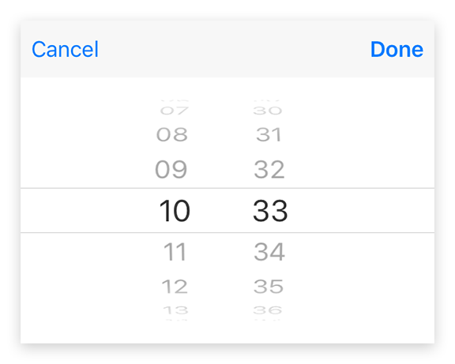

---
---
# Class "TimeDialog"

<a href="https://developer.mozilla.org/en-US/docs/Web/JavaScript/Reference/Global_Objects/Object" title="View &quot;Object&quot; on MDN">Object</a> > <a href="NativeObject.html" title="NativeObject Class Reference">NativeObject</a> > <a href="Popup.html" title="Popup Class Reference">Popup</a> > <a href="#" >TimeDialog</a>

A `TimeDialog` represents a native dialog pop-up allowing the user to pick a time of day. Properties can only be set before open() is called. The dialog is automatically disposed when closed.


<div class="tabris-image"><figure><div></div><figcaption>Android</figcaption></figure><figure><div></div><figcaption>iOS</figcaption></figure></div>

Type: | <code style="white-space: nowrap">TimeDialog extends <a href="Popup.html" title="Popup Class Reference">Popup</a></code>
Constructor: | public
Singleton: | No
Namespace: |<a href="../modules.html#startup" >tabris</a>
Direct subclasses: | None
JSX Support: | Element: <code style="white-space: nowrap"><a href="TimeDialog.html" title="TimeDialog Class Reference">&lt;TimeDialog/&gt;</a></code><br/>Parent Elements: *Not supported*<br/>Child Elements: *Not Supported*<br/>Text Content: *Not supported*

## Examples
### JavaScript


```js
import {TimeDialog} from 'tabris';

new TimeDialog()
  .onSelect(({date}) => console.log(`Selected ${date}`))
  .open();
```


See also:
  
[<span class='language tsx'>TSX</span> Creating a simple `TimeDialog`](https://playground.tabris.com/?gitref=vundefined&snippet=timedialog.tsx)

## Constructor

### new TimeDialog(properties?)

Parameter|Type|Description
-|-|-
properties | <code style="white-space: nowrap"><a href="../types.html#propertieswidget" title="Properties&lt;Widget&gt;">Properties</a>&lt;<a href="#" >TimeDialog</a>&gt;</code> | Sets all key-value pairs in the properties object as widget properties. *Optional.*

## Static Methods

### open(timeDialog)


Makes the given time dialog visible. Meant to be used with inline-JSX. In TypeScript it also casts the given JSX element from `any` to an actual TimeDialog.


Parameter|Type|Description
-|-|-
timeDialog | <code style="white-space: nowrap"><a href="#" >TimeDialog</a></code> | The time dialog to open


Returns: <code style="white-space: nowrap"><a href="#" >TimeDialog</a></code>

### open(date?)


Creates and opens a time dialog.


Parameter|Type|Description
-|-|-
date | <code style="white-space: nowrap">Date</code> | The time to be displayed in the dialog. The current time is used when no date object is provided. *Optional.*


Returns: <code style="white-space: nowrap"><a href="#" >TimeDialog</a></code>


## Properties

### date


The time to be displayed in the dialog. The current time is used when no date object is provided.

Type: |<code style="white-space: nowrap">Date</code>
Settable: | <a href="../widget-basics.html#widget-properties" >Yes</a>
Change Event: | [`dateChanged`](#datechanged)


## Events

### close

Fired when the time dialog was closed.

EventObject Type: <code style="white-space: nowrap">TimeDialogCloseEvent&lt;<a href="#" >TimeDialog</a>&gt;</code>

Property|Type|Description
-|-|-
date | <code style="white-space: nowrap">Date &#124; <a href="https://developer.mozilla.org/en-US/docs/Web/JavaScript/Data_structures#Null_type" title="View &quot;null&quot; on MDN">null</a></code> | The selected time. Can be `null` when no date was selected.

### select

Fired when a time was selected by the user.

EventObject Type: <code style="white-space: nowrap">TimeDialogSelectEvent&lt;<a href="#" >TimeDialog</a>&gt;</code>

Property|Type|Description
-|-|-
date | <code style="white-space: nowrap">Date</code> | The selected time. Only the time components reflect the users selection. The date component values are undefined.

## Change Events

### dateChanged

Fired when the [date](#date) property has changed.

EventObject Type: <code style="white-space: nowrap"><a href="../types.html#propertychangedeventtargettype-valuetype" title="PropertyChangedEvent&lt;TargetType, ValueType&gt;">PropertyChangedEvent</a>&lt;<a href="#" >TimeDialog</a>, Date&gt;</code>

Property|Type|Description
-|-|-
value | <code style="white-space: nowrap">Date</code> | The new value of [date](#date).

