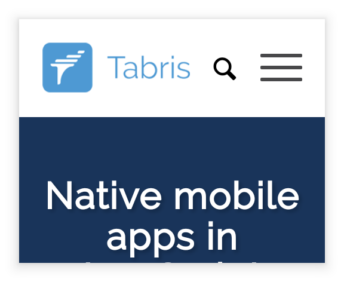
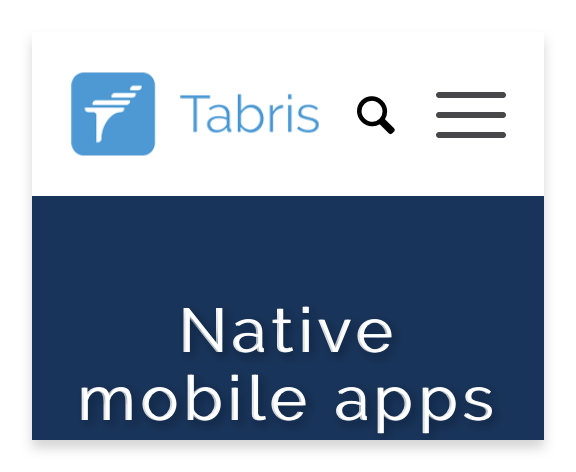

---
---
# Class "WebView"

<a href="https://developer.mozilla.org/en-US/docs/Web/JavaScript/Reference/Global_Objects/Object" title="View &quot;Object&quot; on MDN">Object</a> > <a href="NativeObject.html" title="NativeObject Class Reference">NativeObject</a> > <a href="Widget.html" title="Widget Class Reference">Widget</a> > <a href="#" >WebView</a>

A widget that can display a web page. Since this widget requires a lot of resources it's recommended to have no more than one instance at a time.


<div class="tabris-image"><figure><div></div><figcaption>Android</figcaption></figure><figure><div></div><figcaption>iOS</figcaption></figure></div>

Type: | <code style="white-space: nowrap">WebView extends <a href="Widget.html" title="Widget Class Reference">Widget</a></code>
Constructor: | public
Singleton: | No
Namespace: |<a href="../modules.html#startup" >tabris</a>
Direct subclasses: | None
JSX Support: | Element: <code style="white-space: nowrap"><a href="#" >&lt;WebView/&gt;</a></code><br/>Parent Elements: <code style="white-space: nowrap"><a href="Canvas.html" title="Canvas Class Reference">&lt;Canvas/&gt;</a></code>, <code style="white-space: nowrap"><a href="Cell.html" title="Cell Class Reference">&lt;Cell/&gt;</a></code>, <code style="white-space: nowrap"><a href="Composite.html" title="Composite Class Reference">&lt;Composite/&gt;</a></code>, <code style="white-space: nowrap"><a href="Page.html" title="Page Class Reference">&lt;Page/&gt;</a></code>, <code style="white-space: nowrap"><a href="RefreshComposite.html" title="RefreshComposite Class Reference">&lt;RefreshComposite/&gt;</a></code>, <code style="white-space: nowrap"><a href="Row.html" title="Row Class Reference">&lt;Row/&gt;</a></code>, <code style="white-space: nowrap"><a href="ScrollView.html" title="ScrollView Class Reference">&lt;ScrollView/&gt;</a></code>, <code style="white-space: nowrap"><a href="Stack.html" title="Stack Class Reference">&lt;Stack/&gt;</a></code>, <code style="white-space: nowrap"><a href="Tab.html" title="Tab Class Reference">&lt;Tab/&gt;</a></code><br/>Child Elements: *Not Supported*<br/>

## Examples
### JavaScript


```js
import {WebView, contentView} from 'tabris';

new WebView({
  left: 0, right: 0, top: 0, bottom: 0,
  url: 'https://tabris.com'
}).appendTo(contentView);
```


See also:
  
[<span class='language jsx'>JSX</span> Creating a simple `WebView`](https://playground.tabris.com/?gitref=v3.6.0&snippet=webview.jsx)  
[<span class='language js'>JS</span> Creating browser-like navigation buttons in a `WebView`](https://playground.tabris.com/?gitref=v3.6.0&snippet=webview-navigation.js)  
[<span class='language js'>JS</span> Demonstrating web messaging in a `WebView`](https://playground.tabris.com/?gitref=v3.6.0&snippet=webview-webmessaging.js)  
[Web Messaging on Wikipedia](https://en.wikipedia.org/wiki/Web_Messaging)

## Constructor

### new WebView(properties?)

Parameter|Type|Description
-|-|-
properties | <code style="white-space: nowrap"><a href="../types.html#propertieswidget" title="Properties&lt;Widget&gt;">Properties</a>&lt;<a href="#" >WebView</a>&gt;</code> | Sets all key-value pairs in the properties object as widget properties. *Optional.*

## Methods

### goBack()


Navigate the `WebView` to the previous page if possible.

Returns: <code style="white-space: nowrap"><a href="https://developer.mozilla.org/en-US/docs/Web/JavaScript/Data_structures#Undefined_type" title="View &quot;undefined&quot; on MDN">undefined</a></code>

### goForward()


Navigate the `WebView` to the next page if possible.

Returns: <code style="white-space: nowrap"><a href="https://developer.mozilla.org/en-US/docs/Web/JavaScript/Data_structures#Undefined_type" title="View &quot;undefined&quot; on MDN">undefined</a></code>

### postMessage(message, targetOrigin)


Posts a web message to the underlying `window` object of the WebView. The website in the `WebView` can register for the message in the following fashion: `window.addEventListener('message', callbackFunction)`. For more information see [`Window.postMessage()`](https://developer.mozilla.org/en-US/docs/Web/API/Window/postMessage) API.


Parameter|Type|Description
-|-|-
message | <code style="white-space: nowrap"><a href="https://developer.mozilla.org/en-US/docs/Web/JavaScript/Data_structures#String_type" title="View &quot;string&quot; on MDN">string</a></code> | The message to send. Supports only strings.
targetOrigin | <code style="white-space: nowrap"><a href="https://developer.mozilla.org/en-US/docs/Web/JavaScript/Data_structures#String_type" title="View &quot;string&quot; on MDN">string</a></code> | The URL of the page that receives the message. The message is only sent if the current document URL has the same scheme, domain and path. Use `*` to send to any URL.


Returns: <code style="white-space: nowrap"><a href="#" title="This object">this</a></code>


## Properties

### canGoBack


Whether there is a previous to navigated to via `goBack()`.

Type: |<code style="white-space: nowrap"><a href="https://developer.mozilla.org/en-US/docs/Web/JavaScript/Data_structures#Boolean_type" title="View &quot;boolean&quot; on MDN">boolean</a></code>
Settable: | <a href="../widget-basics.html#widget-properties" >No</a>
Change Event: | [`canGoBackChanged`](#cangobackchanged)


### canGoForward


Whether there is a next page to navigate to via `goForward()`.

Type: |<code style="white-space: nowrap"><a href="https://developer.mozilla.org/en-US/docs/Web/JavaScript/Data_structures#Boolean_type" title="View &quot;boolean&quot; on MDN">boolean</a></code>
Settable: | <a href="../widget-basics.html#widget-properties" >No</a>
Change Event: | [`canGoForwardChanged`](#cangoforwardchanged)


### html


A complete HTML document to display. Always returns the last set value.
Note: `htmlChanged` event will not be fired on iOS when a page is using `history.pushState()` to navigate between pages.

Type: |<code style="white-space: nowrap"><a href="https://developer.mozilla.org/en-US/docs/Web/JavaScript/Data_structures#String_type" title="View &quot;string&quot; on MDN">string</a></code>
Settable: | <a href="../widget-basics.html#widget-properties" >Yes</a>
Change Event: | [`htmlChanged`](#htmlchanged)


### initScript


JavaScript code to be executed before page begins loading.

Type: |<code style="white-space: nowrap"><a href="https://developer.mozilla.org/en-US/docs/Web/JavaScript/Data_structures#String_type" title="View &quot;string&quot; on MDN">string</a></code>
Settable: | <a href="../widget-basics.html#widget-properties" >By Constructor or JSX</a>
Change Event: | Not supported


This property can only be set via constructor or JSX. Once set, it cannot change anymore.


### url


The URL of the web page to display. Relative URLs are resolved relative to 'package.json'. Returns empty string when content from *html* property is displayed.
Note: `urlChanged` event will not be fired on iOS when a page is using `history.pushState()` to navigate between pages.

Type: |<code style="white-space: nowrap"><a href="https://developer.mozilla.org/en-US/docs/Web/JavaScript/Data_structures#String_type" title="View &quot;string&quot; on MDN">string</a></code>
Settable: | <a href="../widget-basics.html#widget-properties" >Yes</a>
Change Event: | [`urlChanged`](#urlchanged)


## Events

### navigate

Fired when the WebView is about to navigate to a new URL.
Note: This event will not be fired on iOS when a page is using `history.pushState()` to navigate between pages.

EventObject Type: <code style="white-space: nowrap">WebViewNavigateEvent&lt;<a href="#" >WebView</a>&gt;</code>

Property|Type|Description
-|-|-
preventDefault | <code style="white-space: nowrap"><a href="https://developer.mozilla.org/en-US/docs/Web/JavaScript/Reference/Global_Objects/Function" title="View &quot;Function&quot; on MDN">Function</a></code> | Call to intercept the navigation. Not possible when the event is only an anchor navigation
url | <code style="white-space: nowrap"><a href="https://developer.mozilla.org/en-US/docs/Web/JavaScript/Data_structures#String_type" title="View &quot;string&quot; on MDN">string</a></code> | The new URL the WebView is about to navigate to.

### load

Fired when the url has been loaded.
Note: This event will not be fired on iOS when a page is using `history.pushState()` to navigate between pages.

EventObject Type: <code style="white-space: nowrap"><a href="EventObject.html" title="EventObject Class Reference">EventObject</a>&lt;<a href="#" >WebView</a>&gt;</code>

This event has no additional parameter.
### download

<p class="platforms"><span class='android-tag' title='supported on Android'>Android</span></p>Fired when the WebView requests a download. The download event provides the properties `url`, `mimeType`, `contentLength` and `contentDisposition`. Supported only on Android.

EventObject Type: <code style="white-space: nowrap">WebViewDownloadEvent&lt;<a href="#" >WebView</a>&gt;</code>

Property|Type|Description
-|-|-
contentDisposition | <code style="white-space: nowrap"><a href="https://developer.mozilla.org/en-US/docs/Web/JavaScript/Data_structures#String_type" title="View &quot;string&quot; on MDN">string</a></code> | Indicates whether the download is expected to be displayed inline or to be downloaded as an attachment.
contentLength | <code style="white-space: nowrap"><a href="https://developer.mozilla.org/en-US/docs/Web/JavaScript/Data_structures#Number_type" title="View &quot;number&quot; on MDN">number</a></code> | The size of the downloaded entity body.
mimeType | <code style="white-space: nowrap"><a href="https://developer.mozilla.org/en-US/docs/Web/JavaScript/Data_structures#String_type" title="View &quot;string&quot; on MDN">string</a></code> | The mime type of the resource to be downloaded.
url | <code style="white-space: nowrap"><a href="https://developer.mozilla.org/en-US/docs/Web/JavaScript/Data_structures#String_type" title="View &quot;string&quot; on MDN">string</a></code> | The URL of the resource to be downloaded.

### message

Fired when a web message has been sent via `window.parent.postMessage(message, targetOrigin)` from inside the `WebView`.

EventObject Type: <code style="white-space: nowrap">WebViewMessageEvent&lt;<a href="#" >WebView</a>&gt;</code>

Property|Type|Description
-|-|-
data | <code style="white-space: nowrap"><a href="https://developer.mozilla.org/en-US/docs/Web/JavaScript/Data_structures#String_type" title="View &quot;string&quot; on MDN">string</a></code> | The sent message.

## Change Events

### urlChanged

Fired when the [url](#url) property has changed.

EventObject Type: <code style="white-space: nowrap"><a href="../types.html#propertychangedeventtargettype-valuetype" title="PropertyChangedEvent&lt;TargetType, ValueType&gt;">PropertyChangedEvent</a>&lt;<a href="#" >WebView</a>, <a href="https://developer.mozilla.org/en-US/docs/Web/JavaScript/Data_structures#String_type" title="View &quot;string&quot; on MDN">string</a>&gt;</code>

Property|Type|Description
-|-|-
value | <code style="white-space: nowrap"><a href="https://developer.mozilla.org/en-US/docs/Web/JavaScript/Data_structures#String_type" title="View &quot;string&quot; on MDN">string</a></code> | The new value of [url](#url).

### htmlChanged

Fired when the [html](#html) property has changed.

EventObject Type: <code style="white-space: nowrap"><a href="../types.html#propertychangedeventtargettype-valuetype" title="PropertyChangedEvent&lt;TargetType, ValueType&gt;">PropertyChangedEvent</a>&lt;<a href="#" >WebView</a>, <a href="https://developer.mozilla.org/en-US/docs/Web/JavaScript/Data_structures#String_type" title="View &quot;string&quot; on MDN">string</a>&gt;</code>

Property|Type|Description
-|-|-
value | <code style="white-space: nowrap"><a href="https://developer.mozilla.org/en-US/docs/Web/JavaScript/Data_structures#String_type" title="View &quot;string&quot; on MDN">string</a></code> | The new value of [html](#html).

### canGoForwardChanged

Fired when the [canGoForward](#cangoforward) property has changed.

EventObject Type: <code style="white-space: nowrap"><a href="../types.html#propertychangedeventtargettype-valuetype" title="PropertyChangedEvent&lt;TargetType, ValueType&gt;">PropertyChangedEvent</a>&lt;<a href="#" >WebView</a>, <a href="https://developer.mozilla.org/en-US/docs/Web/JavaScript/Data_structures#Boolean_type" title="View &quot;boolean&quot; on MDN">boolean</a>&gt;</code>

Property|Type|Description
-|-|-
value | <code style="white-space: nowrap"><a href="https://developer.mozilla.org/en-US/docs/Web/JavaScript/Data_structures#Boolean_type" title="View &quot;boolean&quot; on MDN">boolean</a></code> | The new value of [canGoForward](#cangoforward).

### canGoBackChanged

Fired when the [canGoBack](#cangoback) property has changed.

EventObject Type: <code style="white-space: nowrap"><a href="../types.html#propertychangedeventtargettype-valuetype" title="PropertyChangedEvent&lt;TargetType, ValueType&gt;">PropertyChangedEvent</a>&lt;<a href="#" >WebView</a>, <a href="https://developer.mozilla.org/en-US/docs/Web/JavaScript/Data_structures#Boolean_type" title="View &quot;boolean&quot; on MDN">boolean</a>&gt;</code>

Property|Type|Description
-|-|-
value | <code style="white-space: nowrap"><a href="https://developer.mozilla.org/en-US/docs/Web/JavaScript/Data_structures#Boolean_type" title="View &quot;boolean&quot; on MDN">boolean</a></code> | The new value of [canGoBack](#cangoback).

